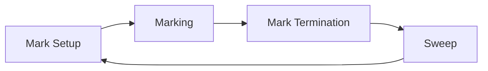
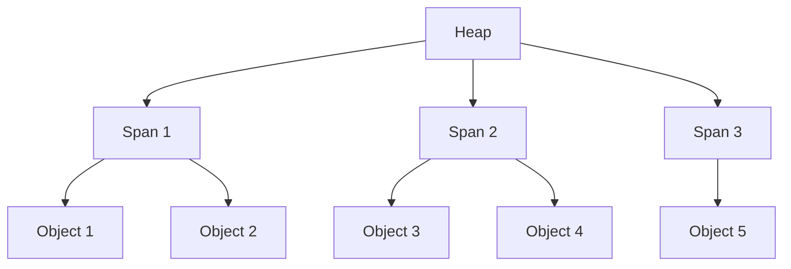
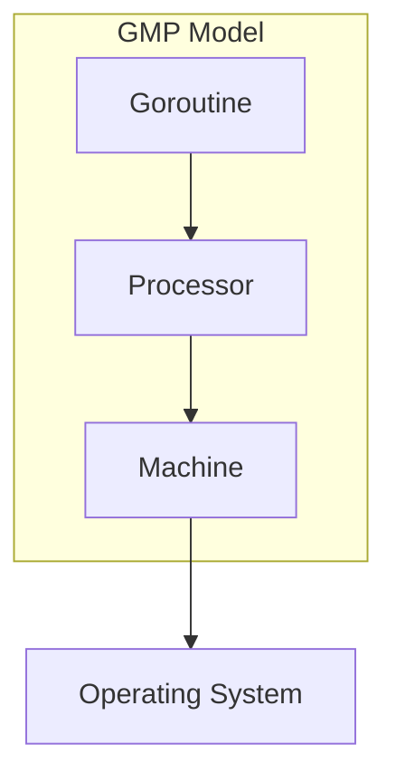
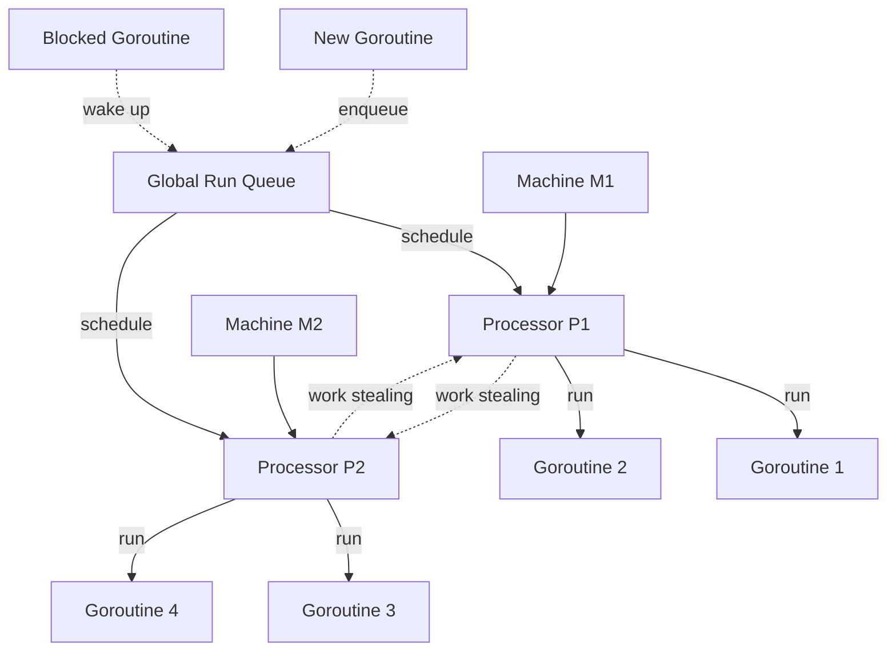

# Golang Interview Questions and Answers

## Basic Concepts

### How does Go handle dependencies?

Go uses a module system for dependency management. The `go.mod` file specifies the module's dependencies and their versions. The `go get` command is used to download and install dependencies.

###  What is the difference between `go build` and `go run` ?

| Feature                   | `go run`                            | `go build`                           |
| ------------------------- | ----------------------------------- | ------------------------------------ |
| **Purpose**               | Compile and run in one step         | Compile to a permanent executable    |
| **Output**                | Temporary executable (deleted)      | Permanent executable on disk         |
| **Use Case**              | Quick testing of small programs     | Building applications for deployment |
| **Performance**           | Slower due to temporary compilation | Faster execution of compiled binary  |
| **Debugging**             | Limited debugging capabilities      | Supports debugging and profiling     |
| **Configuration Options** | None                                | Various options for customization    |

- Use **`go run`** for quick tests and development.
- Use **`go build`** for creating deployable binaries.

## Language Fundamentals

### What are the basic types in Go?

- bool
- string
- int, int8, int16, int32, int64
- uint, uint8, uint16, uint32, uint64
- float32, float64
- complex64, complex128
- byte (alias for uint8)
- rune (alias for int32)

### What is a goroutine?

A goroutine is a lightweight thread managed by the Go runtime. It allows concurrent execution of functions or methods. Goroutines are created using the `go` keyword followed by a function call.

### What is a channel in Go?

A channel is a typed conduit through which you can send and receive values with the channel operator `<-`. Channels are used for communication and synchronization between goroutines.

### What is the difference between unbuffered and buffered channels?

- Unbuffered channels: Sending and receiving operations block until the other side is ready.
- Buffered channels: Have a capacity and can hold that many values before blocking.

### How do you handle errors in Go?

Go doesn't have exceptions. Instead, it uses multiple return values, with the last value typically being an error type. The `error` interface is used to represent error conditions.

### What are slices in Go?

Slices are dynamic, flexible view into arrays. They consist of a pointer to an array, a length, and a capacity. Slices can be resized using the `append` function.

### How do you create a map in Go?

Maps can be created using the `make` function or map literals:

```go
m := make(map[string]int)
n := map[string]int{"foo": 1, "bar": 2}
```

### What is the purpose of the init() function?

The `init()` function is used for initialization tasks. It's automatically executed before the `main()` function. Each file can have multiple `init()` functions.

## Object-Oriented Programming in Go

### How does Go support object-oriented programming?

Go doesn't have classes but uses structs with methods to achieve object-oriented design. It supports composition over inheritance.

### What are methods in Go?

Methods are functions associated with a particular type. They have a receiver argument that appears between the `func` keyword and the method name.

### How do you achieve inheritance in Go?

Go doesn't support inheritance directly. Instead, it uses composition and embedding to reuse code.

### What are interfaces in Go?

Interfaces are named collections of method signatures. They provide a way to specify the behavior of an object.

### How does Go implement polymorphism?

Go achieves polymorphism through interfaces. Any type that implements all the methods of an interface implicitly satisfies that interface.

## Concurrency

### What is the difference between concurrency and parallelism?

Concurrency is about managing multiple tasks that run in overlapping time periods, while parallelism is about tasks that run simultaneously.

### How does Go handle race conditions?

In Go, a race condition occurs when multiple goroutines access shared data concurrently, and at least one of them modifies the data without proper synchronization. This can lead to unpredictable behavior, such as data corruption or inconsistent states.

#### Understanding Race Conditions

A race condition typically happens in scenarios where two or more goroutines attempt to read and write to the same variable simultaneously. For example, consider two goroutines incrementing a shared counter:

```go
package main

import (
    "fmt"
    "sync"
)

var counter int

func increment(wg *sync.WaitGroup) {
    defer wg.Done()
    for i := 0; i < 1000; i++ {
        counter++
    }
}

func main() {
    var wg sync.WaitGroup
    wg.Add(2)

    go increment(&wg)
    go increment(&wg)

    wg.Wait()
    fmt.Println("Final Counter:", counter)
}
```

Running this code multiple times may yield different results due to the race condition affecting the final value of `counter` .

#### Detecting Race Conditions

Go provides a built-in race detector that can be enabled during compilation. You can run your program with the `-race` flag:

```bash
go run -race main.go
```

This will help identify data races by reporting conflicting accesses to shared variables, allowing developers to pinpoint where race conditions occur.

#### Preventing Race Conditions

To prevent race conditions, Go offers several synchronization mechanisms:

1. **Mutexes**: The `sync.Mutex` type allows you to lock and unlock access to shared resources. By locking a mutex before accessing shared data and unlocking it afterward, you ensure that only one goroutine can access the resource at a time.

   Example using a mutex:

   ```go
   var mu sync.Mutex

   func increment(wg *sync.WaitGroup) {
       defer wg.Done()
       mu.Lock()
       counter++
       mu.Unlock()
   }
   ```

2. **Channels**: Channels can also be used for synchronization by ensuring that only one goroutine writes to a variable at a time. This approach promotes safe communication between goroutines.

```go
package main

import (
    "fmt"
)

var counter int // Shared variable

func increment(done chan struct{}) {
    for i := 0; i < 1000; i++ {
        counter++ // Increment the shared counter
    }
    done <- struct{}{} // Signal that the increment is done
}

func main() {
    done := make(chan struct{}, 2) // Create a buffered channel for two signals

    go increment(done) // Start first goroutine
    go increment(done) // Start second goroutine

    // Wait for both goroutines to signal completion
    <-done
    <-done

    fmt.Println("Final Counter:", counter) // Print the final value of counter
}
```

3. **Atomic Operations**: For simple operations like incrementing a counter, you can use the `sync/atomic` package, which provides low-level atomic operations that are safe for concurrent use.

#### Best Practices

- **Minimize Shared State**: Reduce the amount of shared data between goroutines whenever possible.
- **Use the Race Detector**: Regularly test your code with the race detector enabled to catch potential issues early in development.
- **Refactor Code**: If you identify race conditions, consider refactoring your code to implement proper synchronization using mutexes or channels.

### What is a mutex in Go?

A mutex (mutual exclusion) is used to provide a locking mechanism to ensure that only one goroutine is accessing a section of code at any given time.

### What is the select statement used for?

The `select` statement in Go is used to wait on multiple channel operations. It blocks until one of its cases can proceed, then executes that case. This allows for efficient handling of concurrent operations and communication between goroutines.

#### Example

```go
package main

import (
    "fmt"
    "time"
)

func main() {
    channel1 := make(chan int)
    channel2 := make(chan string)

    go func() {
        time.Sleep(1 * time.Second)
        channel1 <- 42
    }()

    go func() {
        time.Sleep(2 * time.Second)
        channel2 <- "Hello"
    }()

    select {
    case data := <-channel1:
        fmt.Println("Received from channel1:", data)
    case data := <-channel2:
        fmt.Println("Received from channel2:", data)
    default:
        fmt.Println("No communication ready.")
    }
}
```

#### Output

The output will be:

```
Received from channel1: 42
```

This occurs after approximately 1 second, demonstrating how `select` efficiently waits for channel operations.

### How can you limit the number of goroutines running concurrently?

You can use a semaphore pattern with buffered channels or use the `sync.WaitGroup` to control the number of concurrent goroutines.

## Memory Management and Performance

### How does garbage collection work in Go?

Go uses a concurrent mark-and-sweep garbage collector. It runs concurrently with the program, minimizing stop-the-world pauses.
#### Garbage Collection

Go uses a concurrent, tri-color mark-and-sweep garbage collector with write barriers.

#### Garbage Collection Phases

1. **Mark Setup**: Preparation for marking phase.
2. **Marking**: Identifying live objects.
3. **Mark Termination**: Completion of marking phase.
4. **Sweep**: Reclaiming memory from dead objects.



#### Tri-Color Algorithm

Objects are divided into three sets:

- **White**: Potentially garbage objects.
- **Gray**: Objects to be scanned.
- **Black**: Live objects, all pointers scanned.

The algorithm ensures that no black object points to a white object when marking is complete.

```go
func mark() {
    // Start with all objects white
    for obj := range allObjects {
        setWhite(obj)
    }
    
    // Mark roots as gray
    for root := range rootSet {
        setGray(root)
    }
    
    // Process gray objects
    for gray queue is not empty {
        obj := dequeue()
        scan(obj)
        setBlack(obj)
    }
}

func scan(obj *Object) {
    for child := range obj.pointers {
        if isWhite(child) {
            setGray(child)
        }
    }
}
```

#### Write Barriers

Write barriers ensure correctness of the tri-color invariant during concurrent marking.

Example of a write barrier:

```go
func writePointer(slot *unsafe.Pointer, ptr unsafe.Pointer) {
    shade(ptr)
    *slot = ptr
}

func shade(ptr unsafe.Pointer) {
    if ptr != nil && isWhite(ptr) {
        setGray(ptr)
    }
}
```

#### GC Triggers

Go's GC can be triggered by various events:

1. Automatic: Based on heap growth (target is 100% heap growth).
2. Forced: By calling `runtime.GC()`.
3. Pacing: GC runs to meet target heap size and CPU utilization.

#### GC Tuning

Go provides several environment variables and runtime functions for GC tuning:

- `GOGC`: Sets the initial garbage collection target percentage.
- `GOMEMLIMIT`: Sets a soft memory limit for the heap.

Example of setting GC percentage programmatically:

```go
import "runtime/debug"

func main() {
    // Set GC target to 50% :`X` MB => `1.5 * X` MB
    debug.SetGCPercent(50)
    
    // Run your program...
}
```

#### Sweeping

After marking, sweeping reclaims memory from dead objects:

1. Spans with no live objects are returned to the heap.
2. Spans with some live objects have their free lists rebuilt.
3. Sweeping is done concurrently and on-demand.

Example of a simplified sweep function:

```go
func sweep(span *mspan) {
    for obj := span.startAddr; obj < span.endAddr; obj += span.elemsize {
        if isMarked(obj) {
            unmark(obj)
        } else {
            // Object is dead, add to free list
            span.freeIndex++
            *(*unsafe.Pointer)(obj) = span.freelist
            span.freelist = obj
        }
    }
    if span.freeIndex == span.nelems {
        // All objects are free, return span to heap
        returnToHeap(span)
    }
}
```

### How does Go handle slice growth when capacity is insufficient?

When a slice's length reaches its capacity and more elements need to be added, Go allocates a new underlying array. 

1. **Capacity check**:
   - Go checks if the current capacity is sufficient for the operation.
   - If `len(slice) == cap(slice)`, it means the slice has reached its capacity.

2. **New array allocation**:
   - If capacity is insufficient, Go allocates a new, larger underlying array.
   - The size of the new array is typically double the current capacity.
   - For very large slices, the growth factor may be smaller to avoid excessive memory usage.

3. **Copy elements**:
   - All existing elements are copied from the old array to the new array.

4. **Update slice header**:
   - The slice header is updated to point to the new underlying array.
   - The capacity is set to the size of the new array.
   - The length is increased to accommodate the new element(s).

5. **Growth algorithm**:
   - The exact growth algorithm can vary between Go versions, but it generally follows this pattern:
     - If the current capacity is less than 1024, double it.
     - If it's greater than or equal to 1024, grow by 25%.

6. **Performance implications**:
   - Growing a slice can be an expensive operation due to memory allocation and copying.
   - To minimize this cost, it's often beneficial to pre-allocate slices with a known capacity.

7. **Example of growth**:

   ```go
   s := make([]int, 0, 2)
   fmt.Println(len(s), cap(s)) // Output: 0 2

   s = append(s, 1, 2, 3)
   fmt.Println(len(s), cap(s)) // Output: 3 4
   ```

8. **Memory efficiency**:
   - While this growth strategy can lead to some wasted space, it provides a good balance between performance and memory usage.

9. **Garbage collection**:
   - The old array becomes eligible for garbage collection once it's no longer referenced.

10. **Best practices**:
    - If you know the final size of the slice in advance, initialize it with that capacity to avoid unnecessary growths.
    - Use `copy()` function for explicit control over slice growth and to avoid unexpected sharing of underlying arrays.

### How does Go handel memory allocation 

Go's memory allocator is a complex system designed for high performance and low latency. It uses a combination of techniques to efficiently manage memory.

#### Memory Allocator Overview

The Go memory allocator uses a hierarchical structure:

1. **Heap**: The main memory area where dynamically allocated objects reside.
2. **Spans**: Large blocks of memory (usually 8KB) used to allocate objects.
3. **Objects**: Individual allocated pieces of memory.



#### Size Classes

Go uses size classes to group objects of similar sizes. This reduces fragmentation and improves allocation speed.

- There are about 70 size classes, ranging from 8 bytes to 32KB.
- Each size class has its own free list of available objects.

Example of size classes:
```go
var class_to_size = [_NumSizeClasses]uint16{
    0,
    8,
    16,
    24,
    32,
    48,
    64,
    80,
    // ... more sizes ...
    32768,
}
```

#### TCMalloc Inspiration

Go's allocator is inspired by TCMalloc (Thread-Caching Malloc), with some key differences:

1. **Per-P Caches**: Instead of per-thread caches, Go uses per-P (processor) caches.
2. **Goroutine Stacks**: Special handling for goroutine stacks, which can grow and shrink.
3. **GC Integration**: Tight integration with the garbage collector.

#### Allocation Process

1. For small objects (≤32KB):
   a. Check the P's mcache for a free object in the appropriate size class.
   b. If mcache is empty, refill it from the central cache (mcentral).
   c. If mcentral is empty, allocate a new span from the heap.

2. For large objects (>32KB):
   - Allocate directly from the heap, rounded up to a multiple of the page size.

Example of a simple allocation:

```go
func allocate(size uintptr) unsafe.Pointer {
    if size <= maxSmallSize {
        // Small allocation
        sizeclass := size_to_class(size)
        mcache := acquirem().p.ptr().mcache
        span := mcache.alloc[sizeclass]
        v := span.freelist
        if v.ptr() == nil {
            v = mcache.refill(sizeclass)
        }
        span.freelist = v.ptr().next
        return unsafe.Pointer(v)
    } else {
        // Large allocation
        return largeAlloc(size)
    }
}
```

#### Stack Allocation

Go uses stack allocation for objects that don't escape to the heap:

1. Escape analysis determines if an object can be stack-allocated.
2. Stack objects have very low allocation/deallocation costs.
3. Stacks can grow and shrink as needed.

Example of stack vs heap allocation:

```go
func stackAlloc() int {
    x := 5 // x is allocated on the stack
    return x
}

func heapAlloc() *int {
    x := new(int) // x is allocated on the heap
    *x = 5
    return x
}
```

Developers can use the `-gcflags "-m"` option when building or running their Go programs to see how escape analysis has determined memory allocation for variables.

For example:

```bash
go build -gcflags "-m" main.go
```  

#### Tiny Allocations

Go has a special optimization for tiny allocations (objects ≤16 bytes):

1. Multiple tiny objects can be packed into a single memory block.
2. This significantly reduces memory overhead for small objects.

#### Large Object Allocation

Large objects (>32KB) are handled differently:

1. Allocated directly from the heap.
2. Use a separate free list for efficient reuse.
3. May trigger immediate garbage collection if the heap grows too much.

#### Memory Profiling

Go provides built-in support for memory profiling:

1. Use `runtime/pprof` package or `go test -memprofile` flag.
2. Analyze with `go tool pprof` for detailed memory usage information.

Example of memory profiling:

```go
import (
    "os"
    "runtime/pprof"
)

func main() {
    f, _ := os.Create("mem.prof")
    defer f.Close()
    pprof.WriteHeapProfile(f)
    
    // Your program logic here
}
```

To analyze:
```
go tool pprof mem.prof
```

### What are some best practices for writing efficient Go code?

- Use goroutines and channels appropriately
- Avoid unnecessary memory allocations
- Use sync.Pool for frequently allocated objects
- Profile your code to identify bottlenecks
- Use efficient data structures

### How can you profile a Go program?

Go provides built-in profiling tools:
- CPU profiling: `go test -cpuprofile cpu.prof`
- Memory profiling: `go test -memprofile mem.prof`
- Block profiling: `go test -blockprofile block.prof`

### What is escape analysis in Go?

Escape analysis is the process by which the Go compiler determines whether a variable's lifetime extends beyond its local scope. This helps in deciding whether to allocate the variable on the stack or the heap.


## Testing and Tooling

### How do you write tests in Go?

Go has a built-in testing framework. Test files are named with a `_test.go` suffix. Test functions start with `Test` and take `*testing.T` as an argument.

### What is table-driven testing?

Table-driven testing is a technique where multiple test cases are defined in a slice or map, and a single test function iterates over these cases.

### What is the purpose of the go vet command?

`go vet` examines Go source code and reports suspicious constructs, such as Printf calls with mismatched arguments.

### How do you document Go code?

Go uses godoc for documentation. Comments preceding package declarations and top-level declarations are extracted as documentation.

## Advanced Concepts

### What are the empty interface and type assertions?

The empty interface `interface{}` can hold values of any type. Type assertions provide access to an interface value's underlying concrete value.

### How does Go support generics?

As of Go 1.18, Go supports generics using type parameters. This allows writing functions and data structures that can work with multiple types.

### How does Go handle panics?

Go handles panics through a mechanism that allows for graceful recovery from unexpected runtime errors. When a panic occurs, the normal execution of a goroutine is halted, and the program starts unwinding the stack, executing any deferred functions in reverse order. The `recover` function can be used within a deferred function to regain control and prevent the program from crashing.

#### Key Concepts

1. **Panic**: 
   - A panic is triggered by runtime errors, such as accessing an out-of-bounds array or dereferencing a nil pointer.
   - When a panic occurs, the program stops executing the current function and begins unwinding the stack, executing deferred functions in Last In, First Out (LIFO) order.
   - If no deferred function handles the panic, the program terminates and prints an error message.

2. **Defer**: 
   - The `defer` statement schedules a function call to be executed after the surrounding function returns. This is useful for cleanup tasks and handling panics.

3. **Recover**: 
   - The `recover` function stops the panic's propagation and returns the value passed to `panic`.
   - It must be called within a deferred function to be effective; otherwise, it returns `nil`.

#### Example

Here’s an example demonstrating how to use `panic`, `defer`, and `recover`:

```go
package main

import (
    "fmt"
)

func recoverFromPanic() {
    if r := recover(); r != nil {
        fmt.Println("Recovered from panic:", r)
    }
}

func riskyFunction() {
    defer recoverFromPanic() // Defer recovery function
    fmt.Println("Executing risky function...")
    panic("Something went wrong!") // Trigger a panic
}

func main() {
    fmt.Println("Start")
    riskyFunction()
    fmt.Println("End") // This line won't be reached due to panic
}
```

#### Output

```
Start
Executing risky function...
Recovered from panic: Something went wrong!
```

#### Explanation

- In this example, when `riskyFunction` triggers a panic, the deferred `recoverFromPanic` function is executed, capturing the panic value and allowing the program to continue running instead of crashing.

#### Conclusion

The combination of `panic`, `defer`, and `recover` in Go provides a robust mechanism for error handling.

### How do you handle configuration in Go applications?

Common approaches include:
- Command-line flags
- Environment variables
- Configuration files (JSON, YAML, TOML)
- Combination of the above using libraries like Viper

### What are some common concurrency patterns in Go?

- Worker pools
- Fan-out, fan-in
- Pipeline
- Cancellation and timeouts using context

#### 1. Worker Pools
- **Definition**: A worker pool is a design pattern where a fixed number of goroutines (workers) are created to process tasks from a queue concurrently.
- **Implementation**: Tasks are sent to a channel, and idle workers pick them up for execution. This approach limits the number of concurrent tasks, helping to manage resource usage effectively.
- **Benefits**: 
  - Reduces overhead from creating and destroying goroutines for each task.
  - Allows for better control over concurrency and resource consumption.

#### 2. Fan-Out, Fan-In
- **Fan-Out**: This pattern involves distributing tasks across multiple goroutines to parallelize work. For example, multiple workers can read from the same input source (like a channel).
- **Fan-In**: This pattern combines results from multiple goroutines into a single channel. It helps in aggregating results while maintaining simplicity in handling outputs.
- **Use Case**: Useful in scenarios where tasks can be processed independently and results need to be collected.

#### 3. Pipeline
- **Definition**: In the pipeline pattern, data flows through a series of processing stages, with each stage handled by a separate goroutine.
- **Implementation**: Each stage reads from one channel and writes to another, creating a chain of processing steps.
- **Benefits**: 
  - Enables separation of concerns by breaking down complex processing into manageable stages.
  - Facilitates concurrent processing at each stage, improving throughput.

#### 4. Cancellation and Timeouts Using Context
- **Context Package**: Go's `context` package provides a way to manage cancellation signals and timeouts across goroutines.
- **Usage**: You can create contexts that carry deadlines or cancellation signals, allowing goroutines to check for termination requests and clean up resources accordingly.
- **Benefits**:
  - Helps prevent resource leaks by ensuring that goroutines can exit gracefully when no longer needed.
  - Simplifies managing timeouts for operations like network requests or long-running computations.

### How does Go support cross-compilation?

Go supports cross-compilation by setting the `GOOS` and `GOARCH` environment variables before building.

```
GOOS=linux GOARCH=amd64 go build
```

### What is context.Context and when would you use it?

`context.Context` is used to carry deadlines, cancellation signals, and request-scoped values across API boundaries and between processes. It helps manage long-running operations and allows for graceful cancellation.

Example:
```go
ctx, cancel := context.WithTimeout(context.Background(), time.Second)
defer cancel()

select {
case <-time.After(2 * time.Second):
    fmt.Println("operation completed")
case <-ctx.Done():
    fmt.Println("operation cancelled:", ctx.Err())
}
```

### Explain the concept of goroutine safety and how to achieve it.

**Goroutine safety** refers to the ability of a function, variable, or data structure to be safely accessed by multiple goroutines concurrently without data races or other concurrency issues. To achieve goroutine safety:

- Use channels for communication between goroutines.
  
- Employ synchronization primitives like `sync.Mutex` and `sync.RWMutex` to protect shared resources.
  
- Avoid sharing mutable state between goroutines whenever possible.

### What is the purpose of the `select` statement in Go?

The `select` statement is used to wait on multiple channel operations. It allows a goroutine to wait on multiple communication operations and proceeds with the first one that becomes ready. If multiple operations are ready, it selects one at random.

Example:
```go
select {
case msg := <-ch1:
    fmt.Println("Received message:", msg)
case ch2 <- someValue:
    fmt.Println("Sent value to ch2")
default:
    fmt.Println("No communication was ready")
}
```

### Explain the concept of goroutine leaks and how to avoid them.

**Goroutine leaks** occur when a goroutine is created but never terminates or is never collected by the garbage collector. This can lead to resource exhaustion and performance degradation. To avoid goroutine leaks:

- Ensure that all created goroutines are properly terminated when they are no longer needed.
  
- Use `context.Context` to signal cancellation and termination of goroutines.
  
- Properly handle and close channels to prevent goroutines from waiting indefinitely.

### What is the purpose of the `reflect` package in Go?

The `reflect` package provides functionality for dynamic inspection and modification of variables. It allows you to write code that can manipulate variables of unknown type. The `reflect` package is useful for:

- Inspecting the type and value of variables at runtime.
  
- Creating and modifying variables dynamically.
  
- Calling methods and functions with dynamic arguments.

Example:
```go
value := reflect.ValueOf(42)
fmt.Println(value.Int()) // Output: 42
```

### Explain the concept of type embedding in Go.

**Type embedding** is a way to achieve composition in Go. It allows you to embed a type (called an anonymous field) within another type. The embedded type's methods are then promoted to the embedding type, making them accessible as if they were defined on the embedding type itself.

Example:
```go
type Person struct {
    Name string
}

func (p *Person) Introduce() {
    fmt.Printf("Hello, my name is %s\n", p.Name)
}

type Student struct {
    *Person
    Grade int
}

student := &Student{
    Person: &Person{"John"},
    Grade:  A,
}
student.Introduce() // Calls Person.Introduce()
```

### What is the purpose of the `sync` package in Go?

The `sync` package provides synchronization primitives to help manage concurrent access to shared resources. It includes:

- `sync.Mutex` and `sync.RWMutex`: Used for mutual exclusion.
  
- `sync.WaitGroup`: Used to wait for a collection of goroutines to finish.
  
- `sync.Once`: Used to ensure that a function is executed exactly once.
  
- `sync.Cond`: Used to broadcast notifications to waiting goroutines.

Source Code Analysis of `sync` 

#### 1. `sync.Mutex`

```go
// Mutex provides mutual exclusion for shared resources.
type Mutex struct {
    state int32   // State of the mutex (locked/unlocked)
    sema  uint32  // Semaphore for blocking goroutines
}

// Lock acquires the mutex, blocking if necessary.
func (m *Mutex) Lock() {
    // Check if already locked; if so, block until unlocked.
}

// Unlock releases the mutex.
func (m *Mutex) Unlock() {
    // Update state and unblock waiting goroutines if any.
}
```

**Mechanism**: Uses atomic operations to manage state and semaphore to block goroutines.

#### 2. `sync.RWMutex`

```go
// RWMutex allows multiple readers or one writer.
type RWMutex struct {
    w       Mutex   // Mutex for exclusive access by writers
    readers int32   // Count of active readers
    readerSem uint32 // Semaphore for managing reader access
    writerSem uint32 // Semaphore for managing writer access
}

// RLock acquires a read lock, allowing multiple concurrent readers.
func (rw *RWMutex) RLock() {
    // Increment reader count; block if a writer is active.
}

// RUnlock releases a read lock.
func (rw *RWMutex) RUnlock() {
    // Decrement reader count and unblock if necessary.
}

// Lock acquires an exclusive write lock.
func (rw *RWMutex) Lock() {
    // Block all readers and wait for exclusive access.
}

// Unlock releases the write lock.
func (rw *RWMutex) Unlock() {
    // Release exclusive access and notify waiting readers/writers.
}
```

**Mechanism**: Combines a mutex with counters and semaphores to manage read/write access efficiently.

#### 3. `sync.WaitGroup`

```go
// WaitGroup waits for a collection of goroutines to finish executing.
type WaitGroup struct {
    noCopy noCopy     // Prevent copying of WaitGroup
    state1 [1]uint32  // Atomic state tracking active goroutines
    done   uint32     // Count of completed goroutines
    sema   uint32     // Semaphore for blocking
}

// Add increments the WaitGroup counter by n.
func (wg *WaitGroup) Add(n int) {
    // Increment counter; block if necessary based on done count.
}

// Done decrements the WaitGroup counter by one.
func (wg *WaitGroup) Done() {
    // Increment done count; signal if all goroutines are done.
}

// Wait blocks until the WaitGroup counter is zero.
func (wg *WaitGroup) Wait() {
    // Block until all added goroutines call Done().
}
```

**Mechanism**: Utilizes atomic operations and a semaphore to manage synchronization among multiple goroutines.

#### 4. `sync.Once`

```go
// Once ensures that a function is executed only once.
type Once struct {
    m    Mutex   // Mutex for synchronization
    done uint32  // Flag indicating if function has been called
}

// Do executes the function f only once.
func (o *Once) Do(f func()) {
    o.m.Lock()          // Lock to ensure exclusive access
    if o.done == 0 {   // Check if function has been executed
        f()            // Call the function
        o.done = 1    // Mark as executed
    }
    o.m.Unlock()       // Unlock after execution
}
```

**Mechanism**: Uses a mutex to ensure that the wrapped function is executed only once, regardless of how many times `Do()` is called.

#### 5. `sync.Cond`

```go
// Cond provides a way for goroutines to wait for conditions to be met.
type Cond struct {
    noCopy noCopy      // Prevent copying of Cond
    L      *Mutex      // Locker that must be held when calling Wait or Signal
    notify notifyList  // List of waiting goroutines
}

// Wait atomically releases the mutex and waits for notification.
func (c *Cond) Wait() {
    c.L.Unlock()       // Unlock before waiting to avoid deadlock
    // Block until notified by Signal or Broadcast.
}

// Signal wakes one waiting goroutine, if any.
func (c *Cond) Signal() {
    // Notify one waiting goroutine to wake up.
}

// Broadcast wakes all waiting goroutines, if any.
func (c *Cond) Broadcast() {
    // Notify all waiting goroutines to wake up.
}
```

**Mechanism**: Uses an associated mutex to manage access and a notification system to wake up blocked goroutines based on conditions.

### Explain the concept of function literals and closures in Go.

In Go, **function literals** are anonymous functions that can be assigned to variables or passed as arguments to other functions. **Closures** are function literals that can access variables from an enclosing function, even after the enclosing function has returned.

Example:
```go
func adder() func(int) int {
    sum := 0
    return func(x int) int {
        sum += x
        return sum
    }
}

myAdder := adder()
fmt.Println(myAdder(1)) // Output: 1
fmt.Println(myAdder(2)) // Output: 3
fmt.Println(myAdder(3)) // Output: 6
```

#### Why Closures Can Access Enclosing Variables

**Variable Capture**

When a closure is created, it captures the variables from its surrounding environment (the enclosing function). This means that the closure holds references to these variables, allowing it to access and modify them even after the enclosing function has exited. The variables it captures may be allocated on the heap instead of the stack. 

**Lifetime of Variables**

The captured variables persist in memory as long as the closure is accessible. This is crucial because it allows the closure to maintain state across multiple invocations. For example, if a closure is used as a counter, it can remember the count between calls.

**Memory Management**:

Go's garbage collector manages these captured variables. As long as there are references to the closure, the memory for the captured variables remains allocated. Once the closure is no longer accessible, the garbage collector can reclaim that memory.

### What is the purpose of the `unsafe` package in Go?

The `unsafe` package provides functionality for low-level memory manipulation and type conversions. It allows you to bypass type safety and perform operations that are normally not allowed by the Go type system. However, using the `unsafe` package can lead to undefined behavior and portability issues if not used carefully.

Example:
```go
type Person struct {
    Name string
    Age  int
}

p := &Person{"John", 30}
ptrToAge := unsafe.Pointer(uintptr(unsafe.Pointer(p)) + unsafe.Offsetof(p.Age))
*(*int)(ptrToAge) = 31
```

### Explain the concept of function composition in Go.

**Function composition** is the act of combining simple functions to build more complex ones. In Go, you can achieve function composition using higher-order functions, which are functions that take other functions as arguments or return functions as results.

Example:
```go
func square(x int) int {
    return x * x
}

func double(x int) int {
    return x * 2
}

func compose(f, g func(int) int) func(int) int {
    return func(x int) int {
        return f(g(x))
    }
}

squareAndDouble := compose(square, double)
fmt.Println(squareAndDouble(3)) // Output: 36
```

### What is the purpose of the `fmt` package in Go?

The `fmt` package provides functions for formatting and printing output. It supports printing of various data types, including integers, floats, strings, and custom types. The package also provides functions for reading input from the user.

Example:
```go
name := "John"
age := 30
fmt.Printf("Name: %s, Age: %d\n", name, age)
```

### Explain the concept of method overriding in Go.

In Go, **method overriding** is not possible in the traditional sense. However, you can achieve a similar effect by embedding a type within another type and promoting the embedded type's methods to the embedding type.

Example:
```go
type Animal struct {
    Name string
}

func (a *Animal) Speak() {
    fmt.Printf("%s speaks\n", a.Name)
}

type Dog struct {
    *Animal
}

func (d *Dog) Speak() {
    fmt.Printf("%s barks\n", d.Name)
}

dog := &Dog{&Animal{"Buddy"}}
dog.Speak() // Calls Dog.Speak()
dog.Animal.Speak() // Calls Animal.Speak()
```

### What is the purpose of the `os` package in Go?

The `os` package provides a platform-independent interface to operating system functionality. It includes functions for working with files, directories, processes, and environment variables. The package also provides access to standard input, output, and error streams.

Example:
```go
file, err := os.Open("file.txt")
if err != nil {
    fmt.Println("Error:", err)
    return
}
defer file.Close()

data := make([]byte, 1024)
_, err = file.Read(data)
if err != nil {
    fmt.Println("Error:", err)
    return
}

fmt.Println("File contents:", string(data))
```

### Explain the concept of method sets and pointer receivers in Go.

In Go, a type's **method set** determines which methods can be called on values of that type. The method set is affected by whether the receiver is a pointer or a value:

- For a value receiver, the method set includes all methods with a value receiver.
  
- For a pointer receiver, the method set includes all methods with a pointer receiver or a value receiver.

This means that you can call methods with pointer receivers on both pointer and value types, but methods with value receivers can only be called on value types.

Example:
```go
type Person struct {
    Name string
}

func (p *Person) Introduce() {
    fmt.Printf("Hello, my name is %s\n", p.Name)
}

func main() {
    p1 := &Person{"John"}
    p1.Introduce() // OK

    p2 := Person{"Jane"}
    p2.Introduce() // OK
}
```

### What is the purpose of the `io` package in Go?

The `io` package provides basic interfaces for I/O (input/output) operations. It includes:

- `io.Reader`: Used for reading data from a source.
  
- `io.Writer`: Used for writing data to a destination.
  
- `io.Closer`: Used for closing an I/O resource.

The package also provides utility functions for working with I/O operations, such as `io.Copy`, `io.ReadFull`, and `io.WriteString`.

Example:
```go
reader := strings.NewReader("Hello, World!")
writer := os.Stdout

_, err := io.Copy(writer, reader)
if err != nil {
    fmt.Println("Error:", err)
}
```

### Explain the concept of type assertions in Go.

**Type assertions** are used to extract an interface value's concrete type. They provide a way to safely convert an interface{} value to a specific type. If the conversion is successful, the type assertion returns the value of the specified type; otherwise, it returns the zero value of the specified type and a boolean indicating whether the conversion was successful.

### Why shouldn't we use a large number of goroutines?

Using a large number of goroutines can lead to several issues:

1. **Resource consumption**: Each goroutine requires memory allocation. While goroutines are lightweight compared to OS threads, they still consume memory. Creating too many can lead to excessive memory usage.

2. **Scheduling overhead**: The Go runtime needs to manage and schedule all active goroutines. With a very large number of goroutines, the overhead of scheduling can become significant, potentially impacting performance.

3. **Contention for shared resources**: More goroutines may lead to increased contention for shared resources such as locks, channels, or other synchronization primitives.

4. **Reduced performance**: Paradoxically, creating too many goroutines can lead to decreased overall performance due to the above factors.

5. **Difficulty in debugging**: A program with an excessive number of goroutines can be harder to debug and reason about.

It's generally better to use a reasonable number of goroutines based on the available system resources and the specific requirements of your application. In many cases, using worker pools or other patterns to limit the number of concurrent goroutines can lead to better performance and resource utilization.

### What is the GPM model in Go?

The GPM model in Go refers to the runtime scheduler's architecture:

1. **G (Goroutine)**: 
   - Represents a goroutine, which is a lightweight thread of execution.
   - Contains the stack, the instruction pointer, and other information important for scheduling.
   - Many Gs can exist at the same time.

2. **P (Processor)**:
   - Represents a logical processor, which can be thought of as a context for scheduling.
   - Acts as a local scheduler, managing a queue of runnable goroutines.
   - The number of Ps is typically equal to `GOMAXPROCS`, which by default is the number of CPU cores available.

3. **M (Machine)**:
   - Represents an OS thread.
   - The Go runtime manages a pool of Ms.
   - Ms execute the code of runnable goroutines.

Several benefits:

- It reduces the overhead of creating and destroying threads.
- It allows for better load balancing and work stealing between processors.
- It enables the runtime to efficiently handle blocking operations without creating additional OS threads.

#### GMP Model in Detail

The GMP model is the cornerstone of Go's runtime scheduler. It consists of three primary components: G (Goroutine), M (Machine), and P (Processor).



##### G (Goroutine)
Goroutines are the fundamental unit of execution in Go. They are lightweight, user-space threads managed by the Go runtime.

Key characteristics:
- Represented by the `runtime.g` struct
- Initial stack size of 2KB, which can grow up to 1GB
- Extremely lightweight (creation of thousands of goroutines is common)

Important fields in the `runtime.g` struct:
- `stack`: Describes the stack memory
- `stackguard0`: Used for stack growth checks
- `m`: Current M running this goroutine
- `sched`: Scheduling info (e.g., PC, SP)
- `atomicstatus`: Goroutine status (running, runnable, waiting, etc.)
- `goid`: Unique goroutine identifier
- `waitsince`: Time when the goroutine began waiting (for deadlock detection)
- `waitreason`: Reason for waiting (e.g., chan receive, sleep)

Example of goroutine creation and management:

```go
package main

import (
    "fmt"
    "runtime"
    "sync"
)

func main() {
    var wg sync.WaitGroup
    for i := 0; i < 10000; i++ {
        wg.Add(1)
        go func(id int) {
            defer wg.Done()
            // Simulate some work
            runtime.Gosched() // Yield the processor
            fmt.Printf("Goroutine %d finished\n", id)
        }(i)
    }
    
    // Wait for all goroutines to finish
    wg.Wait()
    
    // Print stats
    fmt.Printf("Number of goroutines: %d\n", runtime.NumGoroutine())
}
```

##### M (Machine)
M represents an OS thread, also known as a machine thread. It's the entity that actually executes the code.

Key characteristics:
- Represented by the `runtime.m` struct
- Number of Ms can be limited by GOMAXPROCS
- Can be in various states: spinning, non-spinning, blocked in syscall

Important fields in the `runtime.m` struct:
- `g0`: Special goroutine for scheduling
- `curg`: Current user goroutine
- `p`: Associated P, or nil if not running
- `nextp`: Next P to run this M
- `spinning`: Whether this M is spinning
- `blocked`: Whether this M is blocked on a syscall
- `park`: Park/unpark state for syscalls

Example of controlling the number of OS threads:

```go
package main

import (
    "fmt"
    "runtime"
    "time"
)

func main() {
    // Get the current number of OS threads
    fmt.Printf("Initial number of OS threads: %d\n", runtime.GOMAXPROCS(-1))
    
    // Set the maximum number of OS threads to 2
    runtime.GOMAXPROCS(2)
    
    // Verify the change
    fmt.Printf("New number of OS threads: %d\n", runtime.GOMAXPROCS(-1))
    
    // Create more goroutines than available threads
    for i := 0; i < 100; i++ {
        go func(id int) {
            time.Sleep(time.Second)
            fmt.Printf("Goroutine %d finished\n", id)
        }(i)
    }
    
    // Wait for goroutines to finish
    time.Sleep(2 * time.Second)
}
```

##### P (Processor)
P is a logical processor that acts as a resource scheduler. It's an abstraction that couples an M to a context where Go can run goroutines.

Key characteristics:
- Represented by the `runtime.p` struct
- Number of Ps equals GOMAXPROCS (default is number of CPU cores)
- Manages a local run queue of goroutines

Important fields in the `runtime.p` struct:
- `status`: Idle, running, syscall, or gc
- `m`: Associated M
- `runq`: Local run queue
- `runnext`: Next G to run
- `mcache`: Memory allocator cache
- `schedtick`: Incremented on every scheduler call
- `syscalltick`: Incremented on every system call
- `sysmontick`: Last tick observed by sysmon

Example of inspecting runtime statistics:

```go
package main

import (
    "fmt"
    "runtime"
    "time"
)

func main() {
    // Create a ticker to periodically print stats
    ticker := time.NewTicker(time.Second)
    defer ticker.Stop()

    // Create some background work
    for i := 0; i < 100; i++ {
        go func() {
            for {
                time.Sleep(time.Millisecond)
            }
        }()
    }

    // Print stats every second
    for i := 0; i < 10; i++ {
        <-ticker.C
        printStats()
    }
}

func printStats() {
    var stats runtime.MemStats
    runtime.ReadMemStats(&stats)

    fmt.Printf("Goroutines: %d\n", runtime.NumGoroutine())
    fmt.Printf("OS Threads: %d\n", runtime.GOMAXPROCS(-1))
    fmt.Printf("Heap Alloc: %d MB\n", stats.HeapAlloc/1024/1024)
    fmt.Printf("Heap Objects: %d\n", stats.HeapObjects)
    fmt.Println("---")
}
```

#### Goroutine Scheduling in Depth

The Go scheduler is a complex system designed to efficiently manage goroutines across available resources. Let's delve into its inner workings.



##### Scheduler Data Structures

1. **Global Run Queue (GRQ)**
   - Holds runnable goroutines not assigned to any P
   - Represented by `sched.runq` in the runtime
   - Used when local run queues are full or during work stealing
   - Implemented as a lock-free ring buffer

2. **Local Run Queue (LRQ)**
   - Each P has its own LRQ
   - Holds goroutines assigned to that P
   - Implemented as a circular queue with a fixed size of 256
   - When full, half of the goroutines are moved to the GRQ

3. **Idle M List**
   - Tracks idle OS threads
   - Managed by the scheduler
   - Used to quickly find an M when a goroutine becomes runnable

4. **Idle P List**
   - Maintains idle P structures
   - Used when allocating P to new M
   - Helps in quick P acquisition for waiting Ms

##### Scheduling Algorithm

The Go scheduler follows a set of rules to determine which goroutine to run next:

1. When a new goroutine is created:
   - If there's space in the current P's local run queue, add it there
   - Otherwise, add it to the global run queue

2. When a P needs to find a goroutine to run:
   - Check its local run queue first
   - If empty, check the global run queue
   - If still empty, try to steal work from other Ps

3. When a goroutine blocks (e.g., on I/O or channel operations):
   - The current M will detach from its P
   - Another M will pick up the P and continue running goroutines

4. When a goroutine unblocks:
   - It's placed back on a run queue (local or global)
   - If there's an idle P, it may be scheduled immediately

Here's a simplified version of the scheduler's main loop:

```go
func schedule() {
    // This function never returns. It will run the scheduler in an infinite loop.
    for {
        // Find a runnable goroutine to execute
        gp := findRunnable()

        // Execute the goroutine
        execute(gp)

        // The goroutine has finished or yielded. Clean up and prepare for the next one.
        if gp.is_finished {
            gp.destroy()
        } else {
            // The goroutine yielded. Put it back in a run queue.
            runqput(gp)
        }
    }
}

func findRunnable() *g {
    // Check local run queue
    if gp := runqget(); gp != nil {
        return gp
    }

    // Check global run queue
    if gp := globrunqget(); gp != nil {
        return gp
    }

    // Try to steal from other P's
    if gp := stealWork(); gp != nil {
        return gp
    }

    // No work found, prepare to go idle
    return nil
}
```

#### Advanced Scheduling Concepts

##### Preemption

Go uses a combination of cooperative and preemptive scheduling:

1. **Cooperative Scheduling**
   - Goroutines yield control at certain points (e.g., function calls, channel operations)
   - Implemented through checks in the compiler-generated code

2. **Preemptive Scheduling**
   - Introduced in Go 1.14 for long-running goroutines
   - Uses asynchronous preemption via signals (SIGURG on Unix systems)
   - Allows interruption of CPU-bound goroutines

Example of a CPU-bound goroutine that can be preempted:

```go
func cpuIntensiveTask() {
    for i := 0; i < 1e10; i++ {
        // This loop can now be preempted by the scheduler
        heavyComputation()
    }
}
```

##### Work Stealing

Work stealing is a technique used by the Go scheduler to balance load across processors:

1. When a P's local run queue is empty, it attempts to steal work from other Ps
2. The stealing process is randomized to avoid contention
3. If stealing fails, the P checks the global run queue and network poller

Implementation details:
- Uses a random starting point to avoid always stealing from the same P
- Steals half of the victim's local run queue to minimize future stealing

```go
func stealWork() *g {
    // Try to steal from other P's local run queues
    for i := 0; i < len(allP); i++ {
        if gp := trySteal(allP[i]); gp != nil {
            return gp
        }
    }
    return nil
}

func trySteal(p *p) *g {
    if !runqempty(p) {
        return runqsteal(p, nil)
    }
    return nil
}
```

##### Syscall Handling

When a goroutine makes a syscall, special handling is required to ensure efficient use of resources:

1. The M running the goroutine enters syscall mode
2. The P is detached from the M to allow other goroutines to run
3. If there are no idle Ms, a new M may be created to run the P
4. When the syscall completes, the goroutine is rescheduled

Example of syscall handling:

```go
func performSyscall() {
    // Entering syscall
    entersyscall()
    
    // Perform the actual syscall
    result := syscall.Read(fd, buffer)
    
    // Exiting syscall
    exitsyscall()
    
    // Use the result
    processData(result)
}
```

##### Spinning Threads

The Go scheduler uses spinning threads to reduce latency:

1. Some Ms may spin instead of going to sleep immediately
2. Spinning Ms check for new work frequently
3. This helps in quickly responding to newly runnable goroutines
4. The number of spinning Ms is limited to avoid wasting CPU

Spinning states:
- Spinning looking for work
- Spinning waiting for GRQ lock

#### Runtime Hooks and Tracing

Go provides several hooks and tracing capabilities for advanced scheduling analysis:

1. **Runtime Tracing**
   - Enabled with `runtime/trace` package
   - Provides detailed information about goroutine scheduling, GC, and more

2. **Scheduler Tracing**
   - Enabled with `GODEBUG=schedtrace=X` environment variable
   - Prints scheduler state every X milliseconds

3. **Execution Tracing**
   - Uses `runtime.Trace()` and `runtime.StopTrace()` functions
   - Allows for custom tracing points in code

Example of using runtime tracing:

```go
package main

import (
    "os"
    "runtime/trace"
)

func main() {
    // Create a trace file
    f, err := os.Create("trace.out")
    if err != nil {
        panic(err)
    }
    defer f.Close()

    // Start tracing
    err = trace.Start(f)
    if err != nil {
        panic(err)
    }
    defer trace.Stop()

    // Your program logic here
    for i := 0; i < 10; i++ {
        go func() {
            // Some work
        }()
    }

    // Wait for goroutines to finish
    // ...
}
```

To analyze the trace:
```
go tool trace trace.out
```

### Is there a limit to the number of goroutines that can be created in Go?

There is no hard limit on the number of goroutines that can be created in Go. However, practical limits exist due to several factors:

1. **Available system memory**: Each goroutine requires a small amount of memory for its stack (typically starting at 2KB). Creating millions of goroutines could potentially exhaust available memory.

2. **OS resources**: While goroutines are managed by the Go runtime, they still rely on underlying OS resources. The number of file descriptors or other OS-level limits could potentially be a bottleneck.

3. **Go runtime's management capabilities**: The Go scheduler needs to manage all these goroutines. While it's highly efficient, there could be performance implications when dealing with an extremely large number of goroutines.

4. **Application design**: The practical limit often depends on the specific application's design and requirements.

In practice, Go programs can often manage hundreds of thousands or even millions of goroutines on modern hardware. However, it's important to note that just because you can create that many goroutines doesn't mean you should. The optimal number depends on your specific use case, available resources, and performance requirements.

Some benchmarks have shown Go managing over 100 million goroutines on high-end hardware, but such extreme cases are rarely necessary or beneficial in real-world applications. It's generally better to use patterns like worker pools to manage concurrency more efficiently.

### What are the differences between threads and coroutines?

Threads and coroutines are both mechanisms for achieving concurrent execution, but they have several key differences:

1. **Management**:
   - Threads are managed by the operating system.
   - Coroutines are managed by the application (or language runtime).

2. **Weight**:
   - Threads are relatively heavyweight, requiring more system resources.
   - Coroutines are lightweight, with minimal overhead.

3. **Scheduling**:
   - Threads use preemptive scheduling, where the OS can interrupt a thread at any time.
   - Coroutines use cooperative scheduling, where they voluntarily yield control.

4. **Context Switching**:
   - Thread context switches are more expensive, involving the OS.
   - Coroutine context switches are typically faster and managed by the application.

5. **Parallelism**:
   - Threads can achieve true parallelism on multi-core systems.
   - Coroutines are concurrent but not necessarily parallel (though some implementations, like Go's goroutines, can utilize multiple cores).

6. **Stack**:
   - Each thread has its own fixed-size stack.
   - Coroutines often use a shared stack or have dynamically sized stacks.

7. **Creation and Destruction**:
   - Creating and destroying threads is more resource-intensive.
   - Coroutines can be created and destroyed with less overhead.

8. **State Preservation**:
   - Threads maintain their own stack and registers.
   - Coroutines can easily save and restore their state.

9. **Scalability**:
   - The number of threads is limited by system resources.
   - It's often possible to have a much larger number of coroutines.

10. **Programming Model**:
  - Thread programming often involves careful synchronization.
  - Coroutine programming can be more straightforward, especially with abstractions like Go's goroutines and channels.

In Go, goroutines are a form of coroutines, but they have some unique characteristics. They are managed by the Go runtime, which can distribute them across multiple OS threads for parallel execution, combining some benefits of both threads and traditional coroutines.

### What concurrency mechanisms does Golang support?

Golang supports several concurrency mechanisms:

1. **Goroutines**:
   - Lightweight threads managed by the Go runtime.
   - Created with the `go` keyword.
   - Allow concurrent execution of functions.

2. **Channels**:
   - Provide a way for goroutines to communicate and synchronize.
   - Can be buffered or unbuffered.
   - Follow the "Don't communicate by sharing memory; share memory by communicating" principle.

3. **Select Statement**:
   - Allows a goroutine to wait on multiple channel operations.
   - Provides non-blocking communication on channels.

4. **Sync Package**:
   - `Mutex` and `RWMutex` for mutual exclusion.
   - `WaitGroup` for waiting for a collection of goroutines to finish.
   - `Once` for one-time initialization.
   - `Cond` for waiting for/announcing condition changes.

5. **Atomic Operations**:
   - The `sync/atomic` package provides atomic operations for primitive types.

6. **Context Package**:
   - Provides a way to carry deadlines, cancellation signals, and request-scoped values across API boundaries and between goroutines.

7. **Worker Pools**:
   - While not a built-in mechanism, it's a common pattern in Go for managing concurrency.

8. **Semaphores**:
   - Can be implemented using buffered channels.

9. **Memory Synchronization**:
   - The `sync/atomic` package provides functions for synchronizing access to integers and pointers.

10. **Errgroup**:
    - The `golang.org/x/sync/errgroup` package provides synchronization, error propagation, and Context cancelation for groups of goroutines.

These mechanisms allow Go developers to write concurrent programs effectively, choosing the right tool for each specific concurrency challenge. The combination of these features, especially goroutines and channels, forms the core of Go's concurrency model, often referred to as "CSP" (Communicating Sequential Processes) style concurrency.

### How does Go utilize channels for communication?

Go utilizes channels for communication between goroutines, following the principle "Don't communicate by sharing memory; share memory by communicating." Here's how channels are used:

1. **Creation**:
   - Channels are created using the `make` function:
     ```go
     ch := make(chan int) // Unbuffered channel
     ch := make(chan int, 5) // Buffered channel with capacity 5
     ```

2. **Sending Data**:
   - Data is sent to a channel using the `<-` operator:
     ```go
     ch <- 42 // Send value 42 to channel ch
     ```

3. **Receiving Data**:
   - Data is received from a channel using the `<-` operator:
     ```go
     value := <-ch // Receive value from channel ch
     ```

4. **Closing Channels**:
   - Channels can be closed to indicate no more values will be sent:
     ```go
     close(ch)
     ```

5. **Range Over Channels**:
   - You can use a `for range` loop to receive values until the channel is closed:
     ```go
     for value := range ch {
         // Process value
     }
     ```

6. **Select Statement**:
   - Used to handle multiple channel operations:
     ```go
     select {
     case v1 := <-ch1:
         // Handle value from ch1
     case ch2 <- v2:
         // Send v2 to ch2
     default:
         // Do something else if all channel operations would block
     }
     ```

7. **Directional Channels**:
   - Channels can be declared as send-only or receive-only:
     ```go
     var sendCh chan<- int // Send-only channel
     var recvCh <-chan int // Receive-only channel
     ```

8. **Synchronization**:
   - Unbuffered channels provide synchronization between sender and receiver.

9. **Signaling**:
   - Channels can be used to signal events between goroutines.

10. **Fan-out and Fan-in Patterns**:
   -  Multiple goroutines can read from a single channel (fan-out) or write to a single channel (fan-in).

11. **Worker Pools**:
   - Channels are often used to implement worker pools for concurrent task processing.

12. **Timeouts**:
   - Combined with the `time.After` function, channels can implement timeouts in operations.

Channels provide a powerful and safe way to coordinate and communicate between concurrent goroutines, helping to avoid common pitfalls in concurrent programming such as race conditions and deadlocks.

### What's the difference between buffered and unbuffered channels?

Buffered and unbuffered channels in Go have different behaviors and use cases:

Unbuffered Channels:
1. **Capacity**: Have no capacity (or a capacity of 0).
2. **Synchronization**: Provide synchronization between sender and receiver.
3. **Blocking**: 
   - Send operation blocks until a receiver is ready.
   - Receive operation blocks until a sender sends a value.
4. **Use Case**: Best for direct communication where you want the sender and receiver to rendezvous.
5. **Creation**: `ch := make(chan int)`

Buffered Channels:
1. **Capacity**: Have a defined capacity greater than 0.
2. **Asynchronous**: Allow for asynchronous communication up to the buffer size.
3. **Blocking**:
   - Send operation only blocks when the buffer is full.
   - Receive operation only blocks when the buffer is empty.
4. **Use Case**: Useful when you want to decouple sender and receiver, or to implement a producer-consumer pattern with some slack.
5. **Creation**: `ch := make(chan int, capacity)`

Key Differences:
1. **Synchronization**: Unbuffered channels provide stronger synchronization guarantees.
2. **Performance**: Buffered channels can potentially offer better performance in scenarios where you don't need strict synchronization.
3. **Deadlock Risk**: Unbuffered channels are more prone to deadlocks if not used carefully.
4. **Memory Usage**: Buffered channels use more memory due to the buffer.
5. **Backpressure**: Buffered channels can act as a queue, potentially hiding backpressure issues.

Example:
```go
// Unbuffered channel
unbuffered := make(chan int)
go func() { unbuffered <- 1 }() // This will block until there's a receiver
value := <-unbuffered // This will unblock the sender

// Buffered channel
buffered := make(chan int, 1)
buffered <- 1 // This won't block because there's room in the buffer
buffered <- 2 // This will block because the buffer is full
```

Choosing between buffered and unbuffered channels depends on your specific use case and the desired behavior of your concurrent program.

### What is the implementation principle of channels?

Channels in Go are implemented as a circular queue with additional synchronization primitives. Here's an overview of the implementation principles:

1. **Data Structure**:
   - Channels are implemented as a circular queue (ring buffer).
   - The structure includes pointers to the buffer, send and receive indices, and other metadata.

2. **Mutex**:
   - A mutex is used to ensure thread-safety for operations on the channel.

3. **Semaphores**:
   - Two semaphores are used: one for senders and one for receivers.
   - These manage blocking and waking of goroutines.

4. **Goroutine Queues**:
   - Separate queues are maintained for blocked senders and receivers.

5. **Buffer**:
   - For buffered channels, a slice is used to store the buffered elements.
   - Unbuffered channels have a buffer of size 0.

6. **Send Operation**:
   - If the channel is full (or unbuffered with no receiver), the sender blocks.
   - The value is copied to the receiver or to the buffer.
   - If receivers are waiting, one is woken up.

7. **Receive Operation**:
   - If the channel is empty and no senders are ready, the receiver blocks.
   - The value is copied from the sender or from the buffer.
   - If senders are waiting, one is woken up.

8. **Close Operation**:
   - Sets a flag indicating the channel is closed.
   - Wakes up all blocked receivers.
   - Causes future send operations to panic.

9. **Select Statement**:
   - Implemented using a special case of the channel operations.
   - Randomly chooses between ready channel operations.

10. **Memory Model**:
   - Channel operations act as both communication and synchronization points in Go's memory model.

11. **Efficiency**:
   - The implementation is optimized for the common cases, with fast paths for uncontended operations.

12. **Fairness**:
   - The implementation attempts to be fair to senders and receivers, but doesn't guarantee strict FIFO ordering.

13. **Race Detector**:
   - Channel operations are integrated with Go's race detector for identifying race conditions.

Understanding these principles can help in using channels effectively and debugging complex concurrent programs. The actual implementation in Go's runtime is quite complex and optimized, handling various edge cases and ensuring efficiency across different hardware architectures.

### What issues can arise with a closed channel?

Closed channels in Go can lead to several issues if not handled properly:

1. **Panic on Send**:
   - Sending on a closed channel causes a panic.
   ```go
   close(ch)
   ch <- 1 // This will panic
   ```

2. **Immediate Return on Receive**:
   - Receiving from a closed channel immediately returns the zero value of the channel's type and `false` as the second return value.
   ```go
   close(ch)
   value, ok := <-ch // value will be zero value, ok will be false
   ```

3. **Nil Channel Behavior**:
   - Closing a nil channel causes a panic.
   ```go
   var ch chan int
   close(ch) // This will panic
   ```

4. **Double Close**:
   - Closing an already closed channel causes a panic.
   ```go
   close(ch)
   close(ch) // This will panic
   ```

5. **Race Conditions**:
   - If not properly synchronized, there can be race conditions between closing a channel and sending/receiving on it.

6. **Goroutine Leaks**:
   - If goroutines are waiting on a channel that never gets closed, it can lead to goroutine leaks.

7. **Select Statement Behavior**:
   - In a `select` statement, cases for closed channels are always ready, which can lead to busy loops if not handled correctly.

8. **Range Loop Termination**:
   - A `for range` loop over a channel will terminate when the channel is closed, which might be unexpected if not intended.

9. **Lost Messages**:
   - If a channel is closed while there are still unread messages in its buffer, those messages can still be read, but any attempt to send new messages will panic.

10. **Difficulty in Signaling**:
    - Once closed, a channel can't be reopened, which can complicate certain signaling patterns.

Best Practices:
- Only the sender should close a channel.
- Use a done channel pattern for signaling completion.
- Check if a channel is closed before sending (though this isn't race-condition free).
- Use defer to ensure channels are closed in functions that open them.
- Consider using sync.Once for safe channel closing in concurrent scenarios.

Example of safe receiving:
```go
value, ok := <-ch
if !ok {
    // Channel is closed
}
```

Understanding these issues helps in designing robust concurrent programs in Go, avoiding common pitfalls associated with channel usage and closure.

### What types of distributed locks are there? 

Distributed locks are mechanisms used to coordinate access to shared resources across multiple nodes in a distributed system. Here are some common types of distributed locks:

1. **Redis-based locks**:
   - Uses Redis's atomic operations to implement locks.
   - Examples: Redlock algorithm.

2. **Zookeeper-based locks**:
   - Utilizes Zookeeper's ephemeral nodes for locking.

3. **Etcd-based locks**:
   - Uses Etcd's lease mechanism for lock implementation.

4. **Database-based locks**:
   - Implements locks using database transactions or specific locking features.

5. **Consul-based locks**:
   - Uses Consul's key-value store and sessions for lock management.

6. **Hazelcast-based locks**:
   - Distributed locks provided by Hazelcast, an in-memory data grid.

For actual distributed locking, you would typically use one of the aforementioned distributed systems (Redis, Zookeeper, etc.) along with their respective client libraries in Go. 

For example, a Redis-based distributed lock in Go might look something like this (pseudo-code):

```go
func acquireLock(key string, value string, ttl time.Duration) bool {
    success, err := redisClient.SetNX(key, value, ttl).Result()
    return err == nil && success
}

func releaseLock(key string, value string) {
    redisClient.Eval(`
        if redis.call("get", KEYS[1]) == ARGV[1] then
            return redis.call("del", KEYS[1])
        else
            return 0
        end`, []string{key}, value)
}
```

In this case, channels might be used for coordinating the lock acquisition and release within the Go application, but the actual locking mechanism relies on Redis operations.

### How can distributed locks be implemented in a cluster using channels?

Implementing true distributed locks across a cluster using only Go channels is not feasible, as channels are designed for communication within a single process. However, we can discuss a conceptual approach that combines channels with network communication to implement a simplified form of distributed locking. This is more of an educational exercise than a practical solution for real-world distributed systems.

Here's a high-level concept of how you might approach this:

1. **Node Communication**:
   - Each node in the cluster would need to communicate over the network.
   - You could use gRPC, REST APIs, or raw TCP connections for this.

2. **Lock Manager**:
   - Implement a central lock manager or use a leader election algorithm to designate one node as the lock manager.

3. **Lock Representation**:
   - Use a channel to represent the lock state on each node.

4. **Lock Protocol**:
   - To acquire a lock, a node sends a request to the lock manager.
   - The lock manager maintains the global lock state and responds to requests.

### How can parallel goroutines be implemented?

Implementing parallel goroutines in Go involves creating multiple goroutines that can execute concurrently and potentially in parallel on multiple CPU cores. Here are several approaches and best practices:

1. **Basic Goroutine Creation**:
   ```go
   for i := 0; i < numTasks; i++ {
       go func(id int) {
           // Task logic here
       }(i)
   }
   ```

2. **Using WaitGroups**:
   ```go
   var wg sync.WaitGroup
   for i := 0; i < numTasks; i++ {
       wg.Add(1)
       go func(id int) {
           defer wg.Done()
           // Task logic here
       }(i)
   }
   wg.Wait()
   ```

3. **Worker Pools**:
   ```go
   func worker(id int, jobs <-chan int, results chan<- int) {
       for j := range jobs {
           results <- j * 2
       }
   }

   const numWorkers = 3
   jobs := make(chan int, 100)
   results := make(chan int, 100)

   for w := 1; w <= numWorkers; w++ {
       go worker(w, jobs, results)
   }

   for j := 1; j <= 100; j++ {
       jobs <- j
   }
   close(jobs)

   for a := 1; a <= 100; a++ {
       <-results
   }
   ```

4. **Using GOMAXPROCS**:
   ```go
   runtime.GOMAXPROCS(runtime.NumCPU())
   ```

5. **Fan-Out, Fan-In Pattern**:
   ```go
   func fanOut(input <-chan int, workers int) []<-chan int {
       outputs := make([]<-chan int, workers)
       for i := 0; i < workers; i++ {
           outputs[i] = worker(input)
       }
       return outputs
   }

   func fanIn(channels ...<-chan int) <-chan int {
       var wg sync.WaitGroup
       out := make(chan int)
       for _, c := range channels {
           wg.Add(1)
           go func(ch <-chan int) {
               defer wg.Done()
               for n := range ch {
                   out <- n
               }
           }(c)
       }
       go func() {
           wg.Wait()
           close(out)
       }()
       return out
   }
   ```

6. **Using errgroup for Error Handling**:
   ```go
   g, ctx := errgroup.WithContext(context.Background())
   for i := 0; i < numTasks; i++ {
       i := i
       g.Go(func() error {
           // Task logic here
           return nil
       })
   }
   if err := g.Wait(); err != nil {
       // Handle error
   }
   ```

7. **Limiting Concurrency**:
   ```go
   sem := make(chan struct{}, maxConcurrent)
   for i := 0; i < numTasks; i++ {
       sem <- struct{}{}
       go func(id int) {
           defer func() { <-sem }()
           // Task logic here
       }(i)
   }
   ```

8. **Using Contexts for Cancellation**:
   ```go
   ctx, cancel := context.WithCancel(context.Background())
   defer cancel()

   for i := 0; i < numTasks; i++ {
       go func(id int) {
           select {
           case <-ctx.Done():
               return
           default:
               // Task logic here
           }
       }(i)
   }
   ```

Key Considerations:
- Use `runtime.GOMAXPROCS(runtime.NumCPU())` to utilize all CPU cores (this is the default in Go 1.5+).
- Be mindful of shared resource access and use appropriate synchronization mechanisms.
- Consider the nature of your tasks - I/O-bound vs CPU-bound - when deciding on the number of goroutines.
- Use profiling tools to optimize performance and identify bottlenecks.
- Implement proper error handling and propagation.
- Use cancellation mechanisms (like `context`) for long-running operations.

By applying these patterns and considering the specific requirements of your application, you can effectively implement parallel processing using goroutines in Go.

### How can concurrent safety be ensured when using shared memory in Go?

Ensuring concurrent safety when using shared memory in Go involves several techniques and synchronization primitives. Here are the main approaches:

1. **Mutex (sync.Mutex)**:
   - Use for exclusive access to shared resources.
   ```go
   var (
       mu sync.Mutex
       count int
   )

   func increment() {
       mu.Lock()
       defer mu.Unlock()
       count++
   }
   ```

2. **Read-Write Mutex (sync.RWMutex)**:
   - Allows multiple readers or one writer.
   ```go
   var (
       rwMu sync.RWMutex
       data map[string]string
   )

   func read(key string) string {
       rwMu.RLock()
       defer rwMu.RUnlock()
       return data[key]
   }

   func write(key, value string) {
       rwMu.Lock()
       defer rwMu.Unlock()
       data[key] = value
   }
   ```

3. **Atomic Operations**:
   - For simple operations on integers and pointers.
   ```go
   var count int64

   func increment() {
       atomic.AddInt64(&count, 1)
   }
   ```

4. **Channels**:
   - Use channels to synchronize access to shared data.
   ```go
   type Counter struct {
       c chan int
       value int
   }

   func (ctr *Counter) Increment() {
       ctr.c <- 1
   }

   func (ctr *Counter) run() {
       for {
           select {
           case <-ctr.c:
               ctr.value++
           }
       }
   }
   ```

5. **sync.Once**:
   - Ensures a function is executed only once.
   ```go
   var (
       instance *singleton
       once sync.Once
   )

   func getInstance() *singleton {
       once.Do(func() {
           instance = &singleton{}
       })
       return instance
   }
   ```

6. **sync.WaitGroup**:
   - Waits for a collection of goroutines to finish.
   ```go
   var wg sync.WaitGroup
   for i := 0; i < 5; i++ {
       wg.Add(1)
       go func() {
           defer wg.Done()
           // Do work
       }()
   }
   wg.Wait()
   ```

7. **Context**:
   - For managing cancellation and deadlines across API boundaries.
   ```go
   ctx, cancel := context.WithTimeout(context.Background(), 5*time.Second)
   defer cancel()

   select {
   case <-ctx.Done():
       return ctx.Err()
   case result := <-doWork(ctx):
       return result
   }
   ```

8. **Immutable Data**:
   - Use immutable data structures to avoid synchronization.

9. **Confinement**:
   - Limit shared data to a single goroutine.

10. **Copy Values**:
    - Pass copies of data between goroutines instead of pointers.

11. **sync.Pool**:
    - For efficiently sharing and reusing temporary objects.
    ```go
    var bufferPool = sync.Pool{
        New: func() interface{} {
            return new(bytes.Buffer)
        },
    }

    buffer := bufferPool.Get().(*bytes.Buffer)
    defer bufferPool.Put(buffer)
    // Use buffer
    ```

12. **sync.Map**:
    - A concurrent map safe for simultaneous use by multiple goroutines.
    ```go
    var m sync.Map

    m.Store("key", "value")
    value, ok := m.Load("key")
    ```

Best Practices:
- Prefer channels for communication between goroutines.
- Use the principle of "Don't communicate by sharing memory; share memory by communicating."
- Minimize the scope and duration of locks.
- Use the `go vet` tool and race detector (`go run -race`) to identify potential issues.
- Consider using higher-level synchronization patterns like worker pools.
- Be aware of false sharing in multi-core systems.
- Document the concurrency strategy for shared resources.

By applying these techniques appropriately, you can ensure concurrent safety when using shared memory in Go. The choice of method depends on the specific requirements of your application, such as read/write patterns, performance needs, and complexity of the shared state.

Certainly! Here's an English version on how to gracefully close channels in Go:

### How to gracefully closing channels in Go

#### 1. Basic Principles

- Only the sender should close a channel, not the receiver.
- Channels don't need to be closed every time. Only close when you need to tell the receiver that no more data will be sent.
- Closing an already closed channel will cause a panic, so avoid this situation.

#### 2. Common Patterns

##### a. Using sync.Once to ensure closing only once

```go
type DataChannel struct {
    ch chan int
    once sync.Once
}

func (dc *DataChannel) Close() {
    dc.once.Do(func() {
        close(dc.ch)
    })
}
```

##### b. Using a dedicated close signal channel

```go
func worker(done <-chan struct{}) {
    for {
        select {
        case <-done:
            return
        default:
            // Do work
        }
    }
}

func main() {
    done := make(chan struct{})
    go worker(done)
    
    // Some time later
    close(done)
}
```

##### c. Using context for control

```go
package main

import (
    "context"
    "fmt"
    "time"
)

func main() {
    ctx, cancel := context.WithCancel(context.Background())
    defer cancel() // Ensure resources are freed

    ch := make(chan int)

    go func() {
        for i := 0; i < 5; i++ {
            select {
            case <-ctx.Done(): // Listen for cancellation
                fmt.Println("Goroutine cancelled, closing channel.")
                close(ch) // Close the channel when cancelled
                return
            case ch <- i: // Send data to channel
            }
        }
        close(ch) // Close the channel after sending all data
    }()

    // Simulate some condition to cancel
    time.Sleep(2 * time.Second)
    cancel() // Cancel the context

    for value := range ch { // Read values until the channel is closed
        fmt.Println(value)
    }

    fmt.Println("Channel closed.")
}
```

### How to Prevent Closing a Channel Multiple Times and Notify Other Channels in Go

#### 1. Use a Wrapper Struct with Mutex

Create a struct that wraps the channel and includes a mutex to ensure safe closure.

```go
type SafeChannel struct {
    ch     chan int
    closed bool
    mutex  sync.Mutex
}

func (sc *SafeChannel) SafeClose() {
    sc.mutex.Lock()
    defer sc.mutex.Unlock()
    if !sc.closed {
        close(sc.ch)
        sc.closed = true
    }
}
```

#### 2. Use `sync.Once` for Closing

Utilize `sync.Once` to ensure the channel is closed only once.

```go
type MyChannel struct {
    ch   chan int
    once sync.Once
}

func (mc *MyChannel) SafeClose() {
    mc.once.Do(func() {
        close(mc.ch)
    })
}
```

#### 3. Implement a notification mechanism using `sync.Cond`

```go
package main

import (
    "fmt"
    "sync"
)

func main() {
    var mu sync.Mutex
    cond := sync.NewCond(&mu)

    // Goroutine that waits for notification
    go func() {
        mu.Lock()
        defer mu.Unlock()
        fmt.Println("Waiting for notification...")
        cond.Wait()
        fmt.Println("Received notification!")
    }()

    // Simulate some work before sending notification
    mu.Lock()
    fmt.Println("Sending notification...")
    cond.Signal() // Notify the waiting goroutine
    mu.Unlock()

    // Wait for user input before exiting
    var input string
    fmt.Scanln(&input)
}
```
### Are locks in Go reentrant?

No, locks in Go (specifically `sync.Mutex` and `sync.RWMutex`) are not reentrant. This is an important characteristic to understand when working with Go's concurrency primitives.

Key points about non-reentrant locks in Go:

1. **Definition of Reentrant Lock**:
   A reentrant lock (also known as a recursive lock) is a lock that can be acquired multiple times by the same goroutine without causing a deadlock.

2. **Go's Mutex Behavior**:
   - If a goroutine tries to lock a `sync.Mutex` that it has already locked, it will deadlock.
   - This applies to both `sync.Mutex` and `sync.RWMutex`.

### Will It Wait Indefinitely If It Cannot Acquire the Lock?

Yes, if a goroutine attempts to acquire a lock that is already held by another goroutine, it will block and wait indefinitely until the lock becomes available. This blocking behavior is inherent to how mutexes function in Go, ensuring that only one goroutine can hold the lock at any given time.

### How to Implement a Timeout Lock?

To implement a lock with a timeout in Go, you can use a combination of channels and context. Here’s an example using `context.WithTimeout`:

```go
package main

import (
    "context"
    "fmt"
    "sync"
    "time"
)

type Lock struct {
    mu sync.Mutex
}

func (l *Lock) LockWithTimeout(ctx context.Context) error {
    done := make(chan struct{})
    go func() {
        l.mu.Lock()
        close(done)
    }()

    select {
    case <-done:
        return nil // Successfully acquired the lock
    case <-ctx.Done():
        return ctx.Err() // Timeout occurred
    }
}

func main() {
    lock := &Lock{}
    ctx, cancel := context.WithTimeout(context.Background(), 2*time.Second)
    defer cancel()

    if err := lock.LockWithTimeout(ctx); err != nil {
        fmt.Println("Failed to acquire lock:", err)
        return
    }
    
    // Perform operations while holding the lock
    fmt.Println("Lock acquired")
    
    // Unlock after operations
    lock.mu.Unlock()
}
```

This code snippet demonstrates how to acquire a lock with a timeout using Go's context package.

### How Are Slices Implemented in Go?

Go slices are built on top of arrays and consist of three components:

- **Pointer**: A pointer to the first element of the array that is referenced by the slice.
- **Length**: The number of elements in the slice.
- **Capacity**: The maximum number of elements that can be stored in the slice without reallocating.

When a slice is created, it does not allocate memory for its elements; instead, it points to an underlying array. If the slice grows beyond its capacity, Go automatically allocates a new larger array and copies the existing elements into it. This mechanism allows slices to be flexible and efficient for dynamic data handling.

### How do `new` and `make` allocate memory in Go, and what are the underlying principles?

In Go, `new` and `make` are used for memory allocation, but they serve different purposes and have distinct underlying principles.

#### **1. new**

- **Functionality**: `new` allocates memory for a type and initializes it to the zero value, returning a pointer to that type.
- **Usage**:
  ```go
  p := new(int) // p is a pointer to an int initialized to 0
  ```
- **Underlying Principles**:
  - Memory allocated by `new` can be on the heap or stack, typically on the stack unless escape analysis determines it should be on the heap.
  - It only allocates memory without performing any initialization beyond setting it to zero.

#### **2. make**

- **Functionality**: `make` is used to initialize slices, maps, and channels, returning the corresponding value (not a pointer).
- **Usage**:
  ```go
  s := make([]int, 10, 100) // Creates a slice of length 10 and capacity 100
  ```
- **Underlying Principles**:
  - `make` not only allocates memory but also sets up the internal structure (like length and capacity) for slices, maps, or channels.
  - It generally allocates memory on the heap to ensure proper initialization of these composite data types.
