# Comprehensive Technical Analysis: Redis, Pika, and Codis

## Introduction

In the realm of distributed data storage and caching systems, Redis, Pika, and Codis represent three distinct approaches to solving scalability, persistence, and performance challenges. This comprehensive analysis delves deep into the architectures, features, and use cases of these systems, providing detailed code examples and visual representations to facilitate a thorough understanding.

## Redis

Redis (Remote Dictionary Server) is an open-source, in-memory data structure store that has become a cornerstone in modern application architectures. Its versatility allows it to function as a database, cache, message broker, and queue.

### Redis Core Architecture

Redis follows a single-threaded, event-driven model using an I/O multiplexing technique.

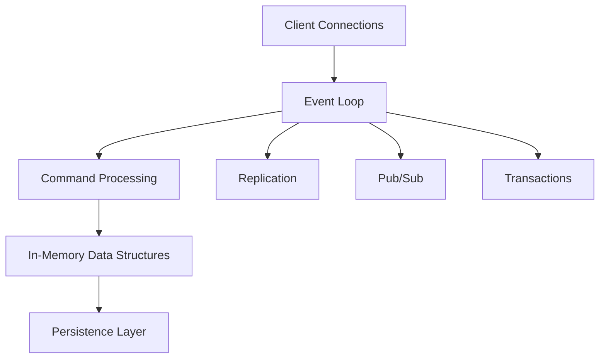

The event loop efficiently handles multiple client connections using mechanisms like `epoll` (Linux) or `kqueue` (BSD).

Key components:
- **Event Loop**: Manages I/O events and timers
- **Command Processing**: Executes Redis commands
- **In-Memory Data Structures**: Stores and manipulates data
- **Persistence Layer**: Handles RDB and AOF persistence
- **Replication**: Manages master-slave replication
- **Pub/Sub**: Implements publish/subscribe messaging
- **Transactions**: Handles atomic command execution

### Redis Data Structures and Implementations

Redis offers a rich set of data structures, each with specific use cases and internal implementations:

1. **Strings**
   - Implementation: Simple dynamic string (SDS)
   - Use case: Caching, counters, bit operations

```redis
SET key "Hello, Redis!"
GET key
INCR counter
SETBIT flag 10 1
```

2. **Lists**
   - Implementation: Linked list or ziplist (for small lists)
   - Use case: Message queues, recent items lists

```redis
LPUSH mylist "item1" "item2"
RPOP mylist
LRANGE mylist 0 -1
```

3. **Sets**
   - Implementation: Hash table or intset (for small integer sets)
   - Use case: Unique items, relations between objects

```redis
SADD myset "member1" "member2"
SMEMBERS myset
SINTER set1 set2
```

4. **Sorted Sets**
   - Implementation: Skip list and hash table
   - Use case: Leaderboards, priority queues

```redis
ZADD leaderboard 100 "player1" 200 "player2"
ZRANGE leaderboard 0 -1 WITHSCORES
```

5. **Hashes**
   - Implementation: Hash table or ziplist (for small hashes)
   - Use case: Object representation, field-value pairs

```redis
HSET user:1 name "John" age 30
HGETALL user:1
```

6. **Bitmaps and HyperLogLogs**
   - Implementation: Special encoding of string keys
   - Use case: Space-efficient storage of boolean information, cardinality estimation

```redis
SETBIT visitors 10 1
BITCOUNT visitors
PFADD unique_visitors "user1" "user2"
PFCOUNT unique_visitors
```

7. **Streams**
   - Implementation: Radix tree
   - Use case: Log storage, time-series data

```redis
XADD mystream * sensor-id 1234 temperature 19.8
XRANGE mystream - +
```

### Redis Persistence Mechanisms

Redis offers two primary persistence options:

1. **RDB (Redis Database)**
   - Point-in-time snapshots of the dataset
   - Compact single-file format
   - Suitable for backups and disaster recovery

```conf
save 900 1
save 300 10
save 60 10000
```

2. **AOF (Append-Only File)**
   - Logs every write operation
   - Higher durability
   - Supports background rewrite for log compaction

```conf
appendonly yes
appendfsync everysec
auto-aof-rewrite-percentage 100
auto-aof-rewrite-min-size 64mb
```

Implementation details:
- RDB uses fork() to create a child process for snapshotting
- AOF uses a write buffer and background fsync for performance

### Redis Replication and High Availability

Redis supports master-slave replication for high availability and read scalability.

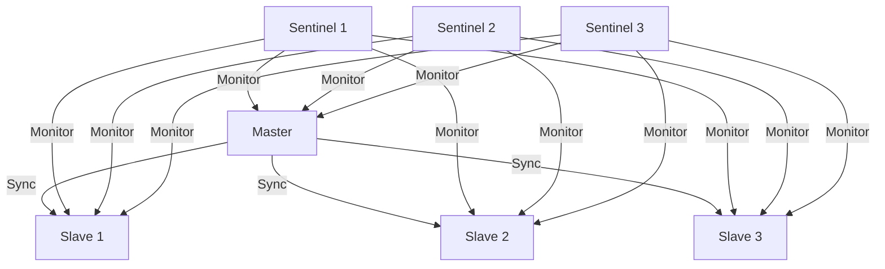

Key features:
- Asynchronous replication
- Partial resynchronization for efficiency
- Redis Sentinel for automatic failover

Configuration example:

```conf
# On slave
slaveof 192.168.1.100 6379
slave-read-only yes

# Sentinel configuration
sentinel monitor mymaster 192.168.1.100 6379 2
sentinel down-after-milliseconds mymaster 5000
sentinel failover-timeout mymaster 60000
```

### Redis Clustering and Sharding

Redis Cluster provides a way to run a Redis installation where data is automatically sharded across multiple Redis nodes.

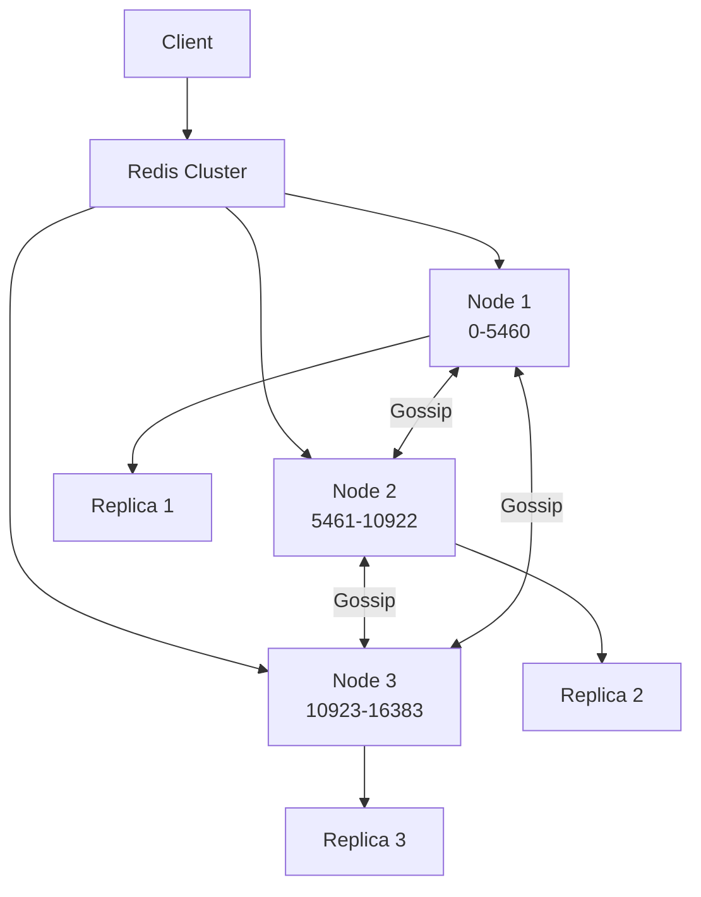

Key features:
- 16384 hash slots distributed across nodes
- Client-side sharding using CRC16
- Automatic failover and resharding

Cluster setup example:

```bash
redis-cli --cluster create 127.0.0.1:7000 127.0.0.1:7001 \
    127.0.0.1:7002 127.0.0.1:7003 127.0.0.1:7004 127.0.0.1:7005 \
    --cluster-replicas 1
```

### Redis Transactions and Lua Scripting

Redis supports transactions and Lua scripting for complex operations.

1. **Transactions**
   - Allows execution of a group of commands in a single step
   - Provides optimistic locking with WATCH command

```redis
MULTI
INCR foo
INCR bar
EXEC
```

2. **Lua Scripting**
   - Allows execution of complex operations atomically
   - Scripts are executed using SHA1 digest for efficiency

```redis
EVAL "return redis.call('SET', KEYS[1], ARGV[1])" 1 mykey myvalue
```

### Redis Pub/Sub and Streams

Redis provides publish/subscribe messaging and a more advanced streams data structure.

1. **Pub/Sub**
   - Allows for real-time messaging between publishers and subscribers

```redis
SUBSCRIBE channel1 channel2
PUBLISH channel1 "Hello, subscribers!"
```

2. **Streams**
   - Append-only log data structure
   - Supports consumer groups for parallel processing

```redis
XADD mystream * field1 value1 field2 value2
XREAD COUNT 2 STREAMS mystream 0-0
```

### Redis Memory Management and Eviction Policies

Redis manages memory carefully and provides eviction policies for when memory limits are reached.

Memory management techniques:
- Jemalloc memory allocator
- Memory sharing between instances (copy-on-write)

Eviction policies:
- volatile-lru
- allkeys-lru
- volatile-random
- allkeys-random
- volatile-ttl
- noeviction

Configuration example:

```conf
maxmemory 100mb
maxmemory-policy allkeys-lru
```

## Pika

Pika is a persistent huge storage service, compatible with the Redis protocol but designed to handle datasets larger than memory.

### Pika Architecture and Design Principles

Pika uses a multi-threaded architecture with RocksDB as its storage engine.

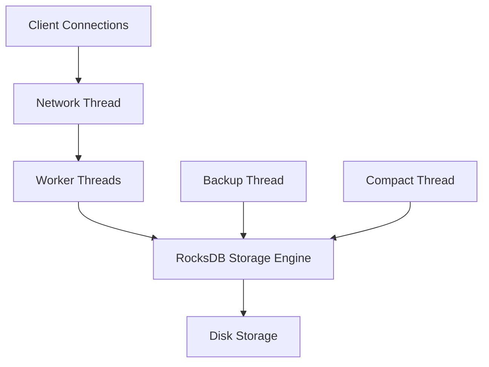

Key components:
- **Network Thread**: Handles client connections and command parsing
- **Worker Threads**: Execute commands and interact with RocksDB
- **RocksDB Storage Engine**: Manages data persistence and retrieval
- **Backup Thread**: Handles asynchronous backups
- **Compact Thread**: Manages RocksDB compaction

### Pika Storage Engine: RocksDB Integration

Pika leverages RocksDB for efficient storage and retrieval of large datasets.

Key features:
- Log-structured merge-tree (LSM) based storage
- Efficient range queries and compactions
- Write-ahead logging for durability

RocksDB configuration example:

```cpp
rocksdb::Options options;
options.create_if_missing = true;
options.write_buffer_size = 64 * 1024 * 1024;  // 64MB
options.max_write_buffer_number = 3;
options.target_file_size_base = 32 * 1024 * 1024;  // 32MB
options.max_background_compactions = 4;
options.max_background_flushes = 2;
options.compression = rocksdb::kSnappyCompression;
```

### Pika Thread Model and Concurrency

Pika uses a multi-threaded model to improve performance and concurrency.

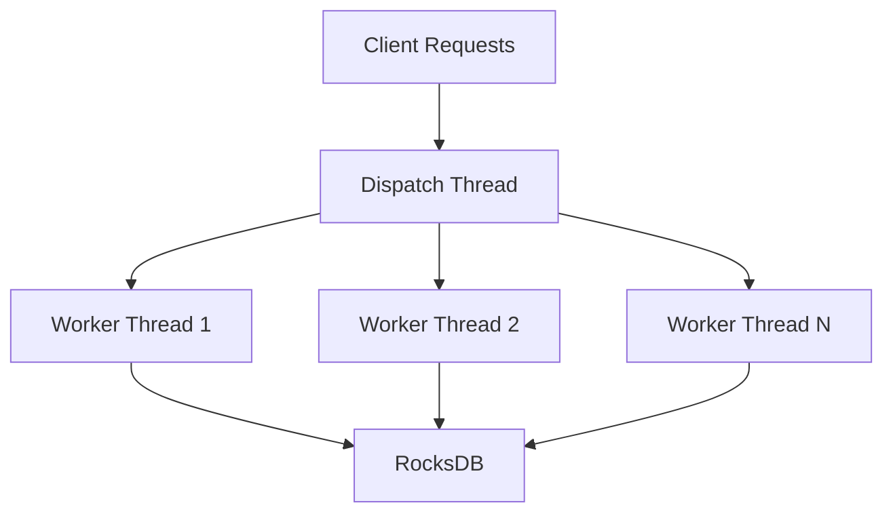

Implementation details:
- Thread pool for handling client requests
- Lock-free data structures for inter-thread communication
- Fine-grained locking for concurrent access to data structures

### Pika Data Structures and Redis Compatibility

Pika supports most Redis data structures and commands, with some limitations.

Supported data structures:
- Strings
- Hashes
- Lists
- Sets
- Sorted Sets

Example of using Pika with a Redis client:

```python
import redis

p = redis.Redis(host='localhost', port=9221, db=0)

# String operations
p.set('key', 'value')
print(p.get('key'))

# Hash operations
p.hset('hash', 'field1', 'value1')
p.hset('hash', 'field2', 'value2')
print(p.hgetall('hash'))

# List operations
p.lpush('list', 'item1', 'item2', 'item3')
print(p.lrange('list', 0, -1))
```

### Pika Replication and Consistency

Pika supports master-slave replication for high availability and data consistency.

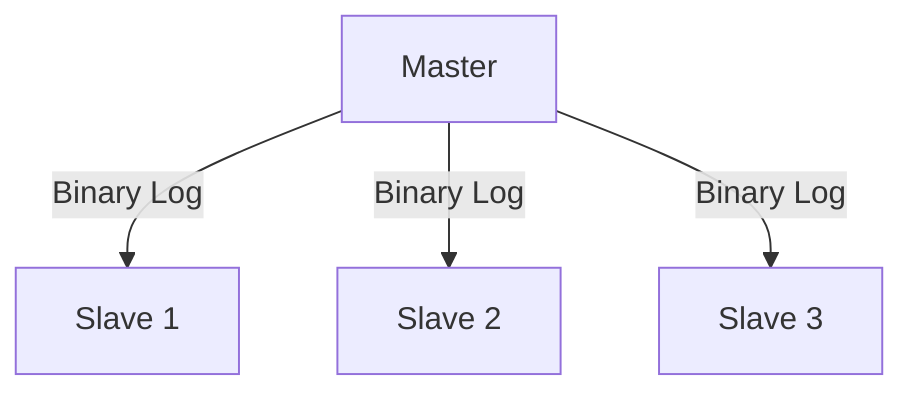

Replication features:
- Asynchronous replication
- Full and incremental sync support
- Configurable sync speed limit

Configuration example:

```conf
# On master
slave-read-only no

# On slave
slaveof 192.168.1.100 9221
slave-read-only yes
```

### Pika Backup and Recovery

Pika provides mechanisms for backup and recovery to ensure data durability.

Backup methods:
1. **Full Backup**: Complete snapshot of the database
2. **Incremental Backup**: Only changes since the last backup

Recovery process:
1. Stop Pika server
2. Replace data directory with backup
3. Start Pika server

Backup command example:

```bash
./pika_tools -t backup -s ./pika.conf
```

### Pika Performance Optimization Techniques

Pika employs various techniques to optimize performance:

1. **Write Amplification Reduction**: Careful tuning of RocksDB parameters
2. **Read Amplification Reduction**: Use of bloom filters and cache
3. **Compaction Optimization**: Background compaction and level-based compaction
4. **Memory Management**: Efficient use of block cache and index cache

RocksDB tuning example:

```cpp
rocksdb::BlockBasedTableOptions table_options;
table_options.block_cache = rocksdb::NewLRUCache(100 * 1024 * 1024);  // 100MB cache
table_options.filter_policy.reset(rocksdb::NewBloomFilterPolicy(10));

rocksdb::Options options;
options.table_factory.reset(NewBlockBasedTableFactory(table_options));
options.optimize_filters_for_hits = true;
options.level_compaction_dynamic_level_bytes = true;
```

## Codis

Codis is a proxy-based Redis cluster solution that supports dynamic scaling and provides high availability.

### Codis System Architecture and Components

Codis consists of several key components working together to provide a scalable Redis cluster solution.

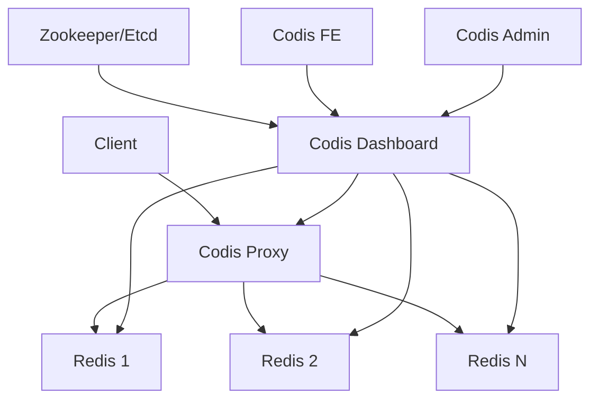

Key components:
- **Codis Proxy**: Stateless proxy that routes requests to the correct Redis instance
- **Codis Dashboard**: Manages the cluster topology and handles administrative tasks
- **Codis FE**: Web interface for cluster management
- **Zookeeper/Etcd**: Distributed configuration and coordination service
- **Redis Instances**: Actual data storage nodes

### Codis Proxy Design and Implementation

The Codis Proxy is a core component that handles request routing and connection management.

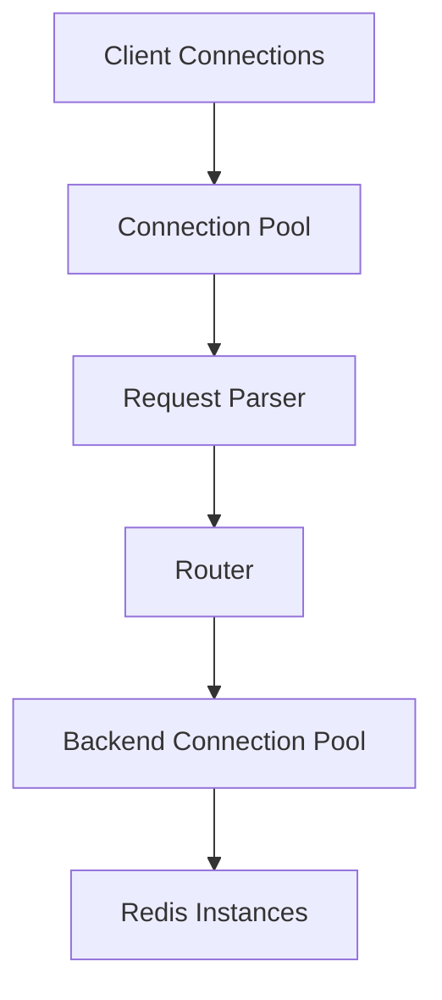

Key features:
- Supports pipelining and multiplexing
- Implements consistent hashing for request routing
- Handles connection pooling for efficient resource utilization

Proxy configuration example:

```toml
product_name = "test"
product_auth = ""

proxy_id = "proxy_1"

admin_addr = "0.0.0.0:11080"
proto_type = "tcp4"
proxy_addr = "0.0.0.0:19000"

jodis_addr = "zookeeper:2181"
jodis_timeout = 10
jodis_compatible = false

session_break_on_failure = false
```

### Codis Data Sharding and Rebalancing

Codis uses pre-sharding and dynamic slot allocation for data distribution.

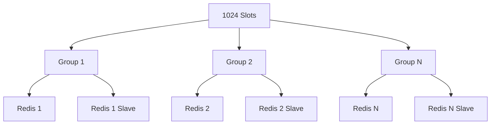

Sharding details:
- 1024 slots pre-defined
- Slots can be migrated between groups
- Each group contains a master-slave pair of Redis instances

Rebalancing process:
1. Initiate rebalance through Codis Dashboard
2. Slots are gradually migrated between groups
3. Proxies update their routing table in real-time

### Codis High Availability and Fault Tolerance

Codis provides high availability through redundancy and automatic failover.

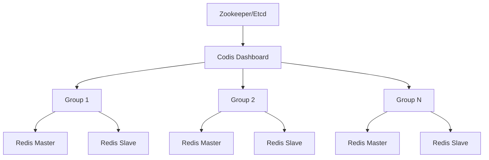

High availability features:
- Automatic failover within groups
- Multiple Codis Proxies for load balancing
- Zookeeper/Etcd for configuration consistency

Failover process:
1. Dashboard detects master failure
2. Promote slave to master
3. Update routing information in Zookeeper/Etcd
4. Proxies update their routing table

### Codis Scaling and Online Migration

Codis supports online scaling without downtime.

Scaling process:
1. Add new Redis instances to the cluster
2. Create new groups in Codis Dashboard
3. Initiate slot migration from existing groups to new groups
4. Proxies automatically update routing information

Migration command example:

```bash
codis-admin --dashboard=localhost:18080 --rebalance --confirm
```

### Codis Monitoring and Management

Codis provides tools for monitoring and managing the cluster.

Monitoring features:
- Codis FE web interface
- Prometheus integration for metrics
- Grafana dashboards for visualization

Management tasks:
- Adding/removing nodes
- Manual failover
- Slot migration
- Configuration updates

### Codis Compatibility and Limitations

While Codis is highly compatible with Redis, it has some limitations:

- Multi-key operations are limited to keys in the same slot
- Some Redis commands are not supported (e.g., KEYS, MOVE, MIGRATE)
- Custom support required for some language clients

Client usage example (Python):

```python
from codis import CodisConnectionPool

pool = CodisConnectionPool(host='localhost', port=19000, db=0)
c = pool.get_connection()

c.set('key', 'value')
print(c.get('key'))

c.hset('hash', 'field', 'value')
print(c.hgetall('hash'))
```

## Comparative Analysis

### Performance Benchmarks

Benchmark results for 100-byte SET/GET operations (operations per second):

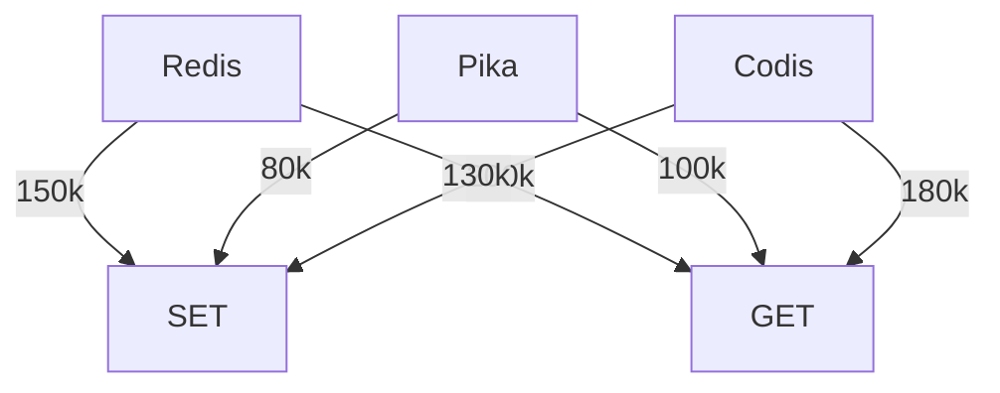

Note: These are approximate values and can vary based on hardware and configuration.

### Use Case Scenarios

1. **Redis**: 
   - High-performance caching
   - Real-time analytics
   - Session storage
   - Leaderboards and counters

2. **Pika**:
   - Large datasets exceeding memory limits
   - Persistent key-value storage
   - Write-heavy workloads

3. **Codis**:
   - Large-scale Redis deployments
   - Need for horizontal scaling
   - High availability requirements

### Scalability and Reliability Comparison

| Feature            | Redis                   | Pika                | Codis                |
| ------------------ | ----------------------- | ------------------- | -------------------- |
| Vertical Scaling   | Excellent               | Good                | Good                 |
| Horizontal Scaling | Limited (Redis Cluster) | Limited             | Excellent            |
| Data Persistence   | Optional (RDB/AOF)      | Always On (RocksDB) | Inherited from Redis |
| High Availability  | Through Sentinel        | Master-Slave        | Built-in             |
| Automatic Failover | Yes (with Sentinel)     | Manual              | Yes                  |
| Online Scaling     | Limited                 | Limited             | Yes                  |

### Operational Complexity

1. **Redis**: 
   - Simple for single instance
   - Moderate complexity for Redis Cluster

2. **Pika**:
   - Moderate complexity
   - Requires RocksDB tuning for optimal performance

3. **Codis**:
   - Higher complexity
   - Requires management of multiple components

## Conclusion

Redis, Pika, and Codis each offer unique solutions to different data storage and caching challenges:

- **Redis** excels in high-performance, in-memory operations and is ideal for scenarios where data fits in memory.
- **Pika** offers a good balance between performance and large dataset support, making it suitable for applications that need to persist data larger than available memory.
- **Codis** provides a scalable Redis cluster solution, ideal for large-scale deployments that require horizontal scaling and high availability.
