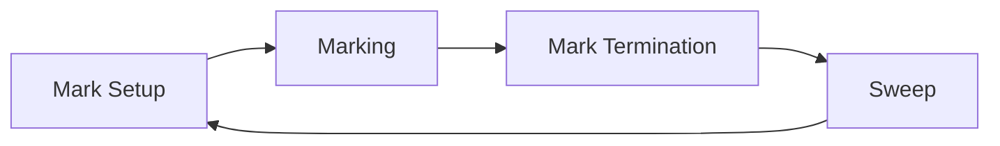

### How does garbage collection work in Go?

#### Garbage Collection

Go uses a concurrent, tri-color mark-and-sweep garbage collector with write barriers.

#### Garbage Collection Phases

1. **Mark Setup**: Preparation for marking phase.
2. **Marking**: Identifying live objects.
3. **Mark Termination**: Completion of marking phase.
4. **Sweep**: Reclaiming memory from dead objects.



#### Tri-Color Algorithm

Objects are divided into three sets:

- **White**: Potentially garbage objects.
- **Gray**: Objects to be scanned.
- **Black**: Live objects, all pointers scanned.

The algorithm ensures that no black object points to a white object when marking is complete.


#### Write Barriers

Write barriers ensure correctness of the tri-color invariant during concurrent marking.

Go implements write barriers primarily through compiler instrumentation and runtime support. 

1. Compiler instrumentation:
   - The Go compiler (specifically the SSA backend) inserts write barrier calls at appropriate points in the code.
   - This happens during the compilation phase, not at runtime.

2. Runtime support:
   - The actual write barrier logic is implemented in the Go runtime, written in Go and assembly. For performance, the core write barrier is implemented in assembly.

3. Write barrier function:
   - The main write barrier function is `writebarrierptr`, implemented in assembly for each architecture.
   - There's also a Go version (`gcWriteBarrier`) for debugging and non-optimized builds.

4. Barrier activation:
   - Write barriers are only active during the marking phase of garbage collection.
   - A global variable `writeBarrier.enabled` controls whether barriers are active.

5. Barrier logic:
   - When active, the write barrier ensures that if a pointer is written to a black (already marked) object, the pointed-to object is marked gray.
   - This prevents a black object from pointing to a white (unmarked) object without the collector's knowledge.

6. Optimizations:
   - Go uses a hybrid write barrier combining Dijkstra and Yuasa approaches.
   - The compiler performs static analysis to eliminate unnecessary barriers.

#### GC Triggers

Go's GC can be triggered by various events:

1. Automatic: Based on heap growth (target is 100% heap growth).
2. Forced: By calling `runtime.GC()`.
3. Pacing: GC runs to meet target heap size and CPU utilization.

#### GC Tuning

Go provides several environment variables and runtime functions for GC tuning:

- `GOGC`: Sets the initial garbage collection target percentage.
- `GOMEMLIMIT`: Sets a soft memory limit for the heap.

Example of setting GC percentage programmatically:

```go
import "runtime/debug"

func main() {
    // Set GC target to 50% :`X` MB => `1.5 * X` MB
    debug.SetGCPercent(50)
    
    // Run your program...
}
```

#### Sweeping

After marking, sweeping reclaims memory from dead objects:

1. Spans with no live objects are returned to the heap.
2. Spans with some live objects have their free lists rebuilt.
3. Sweeping is done concurrently and on-demand.
