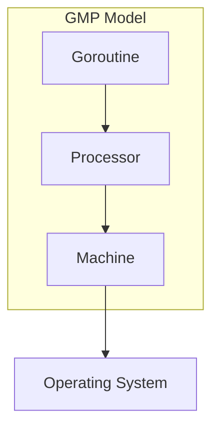
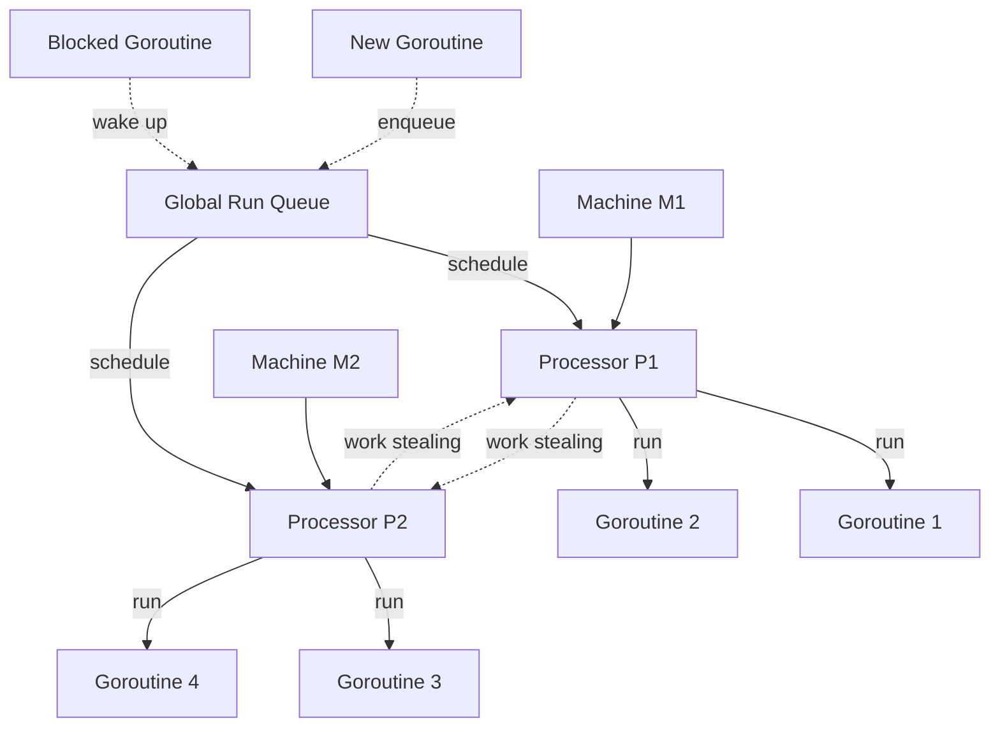

### What is the GPM model in Go?

#### GMP Model

The GMP model is the cornerstone of Go's runtime scheduler.

1. **G (Goroutine)**: 
   - Represents a goroutine, which is a lightweight thread of execution.
   - Contains the stack, the instruction pointer, and other information important for scheduling.
   - Many Gs can exist at the same time.

2. **P (Processor)**:
   - Represents a logical processor, which can be thought of as a context for scheduling.
   - Acts as a local scheduler, managing a queue of runnable goroutines.
   - The number of Ps is typically equal to `GOMAXPROCS`, which by default is the number of CPU cores available.

3. **M (Machine)**:
   - Represents an OS thread.
   - The Go runtime manages a pool of Ms.
   - Ms execute the code of runnable goroutines.
   


#### Goroutine Scheduling



##### Scheduler Data Structures

1. **Global Run Queue (GRQ)**
   - Holds runnable goroutines not assigned to any P
   - Represented by `sched.runq` in the runtime
   - Used when local run queues are full or during work stealing
   - Implemented as a lock-free ring buffer

2. **Local Run Queue (LRQ)**
   - Each P has its own LRQ
   - Holds goroutines assigned to that P
   - Implemented as a circular queue with a fixed size of 256
   - When full, half of the goroutines are moved to the GRQ

3. **Idle M List**
   - Tracks idle OS threads
   - Managed by the scheduler
   - Used to quickly find an M when a goroutine becomes runnable

4. **Idle P List**
   - Maintains idle P structures
   - Used when allocating P to new M
   - Helps in quick P acquisition for waiting Ms

##### Scheduling Algorithm

1. When a new goroutine is created:
   - If there's space in the current P's local run queue, add it there
   - Otherwise, add it to the global run queue

2. When a P needs to find a goroutine to run:
   - Check its local run queue first
   - If empty, check the global run queue
   - If still empty, try to steal work from other Ps

3. When a goroutine blocks (e.g., on I/O or channel operations):
   - The current M will detach from its P
   - Another M will pick up the P and continue running goroutines

4. When a goroutine unblocks:
   - It's placed back on a run queue (local or global)
   - If there's an idle P, it may be scheduled immediately

#### Advanced Scheduling Concepts

##### Preemption

Go uses a combination of cooperative and preemptive scheduling:

1. **Cooperative Scheduling**
   - Goroutines yield control at certain points (e.g., function calls, channel operations)
   - Implemented through checks in the compiler-generated code

2. **Preemptive Scheduling**
   - Introduced in Go 1.14 for long-running goroutines
   - Uses asynchronous preemption via signals (SIGURG on Unix systems)
   - Allows interruption of CPU-bound goroutines

##### Work Stealing

Work stealing is a technique used by the Go scheduler to balance load across processors:

1. When a P's local run queue is empty, it attempts to steal work from other Ps
2. The stealing process is randomized to avoid contention
3. If stealing fails, the P checks the global run queue and network poller

Implementation details:
- Uses a random starting point to avoid always stealing from the same P
- Steals half of the victim's local run queue to minimize future stealing

##### Syscall Handling

When a goroutine makes a syscall, special handling is required to ensure efficient use of resources:

1. The M running the goroutine enters syscall mode
2. The P is detached from the M to allow other goroutines to run
3. If there are no idle Ms, a new M may be created to run the P
4. When the syscall completes, the goroutine is rescheduled

##### Spinning Threads

The Go scheduler uses spinning threads to reduce latency:

1. Some Ms may spin instead of going to sleep immediately
2. Spinning Ms check for new work frequently
3. This helps in quickly responding to newly runnable goroutines
4. The number of spinning Ms is limited to avoid wasting CPU

Spinning states:
- Spinning looking for work
- Spinning waiting for GRQ lock

#### Runtime Hooks and Tracing

Go provides several hooks and tracing capabilities for advanced scheduling analysis:

1. **Runtime Tracing**
   - Enabled with `runtime/trace` package
   - Provides detailed information about goroutine scheduling, GC, and more

2. **Scheduler Tracing**
   - Enabled with `GODEBUG=schedtrace=X` environment variable
   - Prints scheduler state every X milliseconds

3. **Execution Tracing**
   - Uses `runtime.Trace()` and `runtime.StopTrace()` functions
   - Allows for custom tracing points in code

Example of using runtime tracing:

```go
package main

import (
    "os"
    "runtime/trace"
)

func main() {
    // Create a trace file
    f, err := os.Create("trace.out")
    if err != nil {
        panic(err)
    }
    defer f.Close()

    // Start tracing
    err = trace.Start(f)
    if err != nil {
        panic(err)
    }
    defer trace.Stop()

    // Your program logic here
    for i := 0; i < 10; i++ {
        go func() {
            // Some work
        }()
    }

    // Wait for goroutines to finish
    // ...
}
```

To analyze the trace:
```
go tool trace trace.out
```
