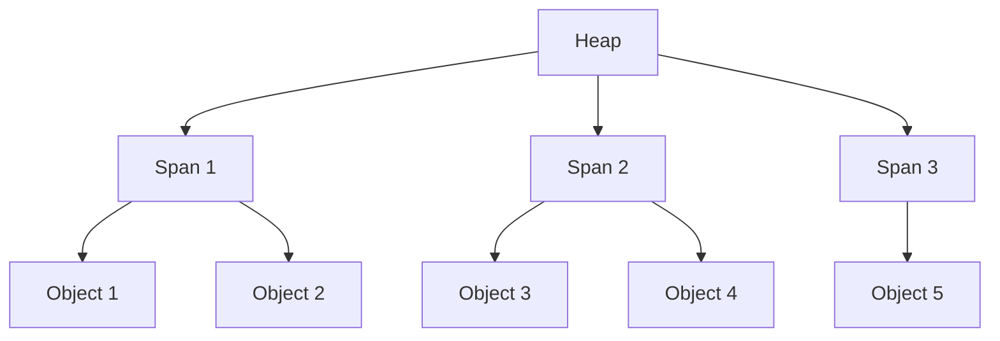

### How does Go handel memory allocation 

#### Memory Allocator Overview

The Go memory allocator uses a hierarchical structure:

1. **Heap**: The main memory area where dynamically allocated objects reside.
2. **Spans**: Large blocks of memory (usually 8KB) used to allocate objects.
3. **Objects**: Individual allocated pieces of memory.



#### Size Classes

Go uses size classes to group objects of similar sizes. This reduces fragmentation and improves allocation speed.

- There are about 70 size classes, ranging from 8 bytes to 32KB.
- Each size class has its own free list of available objects.

Example of size classes:
```go
var class_to_size = [_NumSizeClasses]uint16{
    0,
    8,
    16,
    24,
    32,
    48,
    64,
    80,
    // ... more sizes ...
    32768,
}
```

#### TCMalloc Inspiration

Go's allocator is inspired by TCMalloc (Thread-Caching Malloc), with some key differences:

1. **Per-P Caches**: Instead of per-thread caches, Go uses per-P (processor) caches.
2. **Goroutine Stacks**: Special handling for goroutine stacks, which can grow and shrink.
3. **GC Integration**: Tight integration with the garbage collector.

#### Allocation Process

1. For small objects (≤32KB):
   a. Check the P's mcache for a free object in the appropriate size class.
   b. If mcache is empty, refill it from the central cache (mcentral).
   c. If mcentral is empty, allocate a new span from the heap.

2. For large objects (>32KB):
   - Allocate directly from the heap, rounded up to a multiple of the page size.

#### Stack Allocation

Go uses stack allocation for objects that don't escape to the heap:

1. Escape analysis determines if an object can be stack-allocated.
2. Stack objects have very low allocation/deallocation costs.
3. Stacks can grow and shrink as needed.

Example of stack vs heap allocation:

```go
func stackAlloc() int {
    x := 5 // x is allocated on the stack
    return x
}

func heapAlloc() *int {
    x := new(int) // x is allocated on the heap
    *x = 5
    return x
}
```

Developers can use the `-gcflags "-m"` option when building or running their Go programs to see how escape analysis has determined memory allocation for variables.

For example:

```bash
go build -gcflags "-m" main.go
```  

#### Tiny Allocations

Go has a special optimization for tiny allocations (objects ≤16 bytes):

1. Multiple tiny objects can be packed into a single memory block.
2. This significantly reduces memory overhead for small objects.

#### Large Object Allocation

Large objects (>32KB) are handled differently:

1. Allocated directly from the heap.
2. Use a separate free list for efficient reuse.
3. May trigger immediate garbage collection if the heap grows too much.

#### Memory Profiling

Go provides built-in support for memory profiling:

1. Use `runtime/pprof` package or `go test -memprofile` flag.
2. Analyze with `go tool pprof` for detailed memory usage information.
