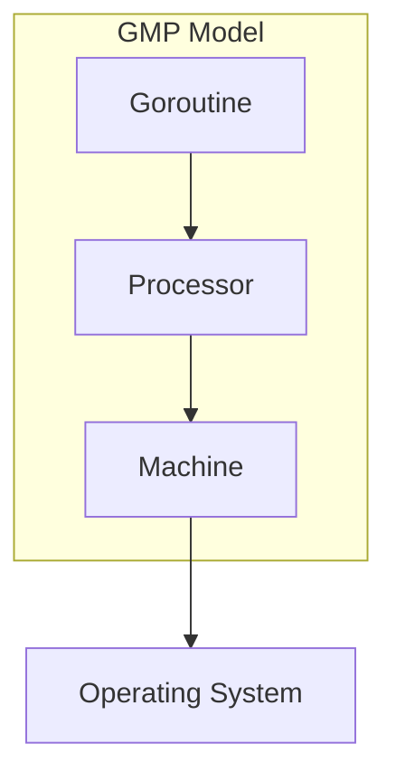
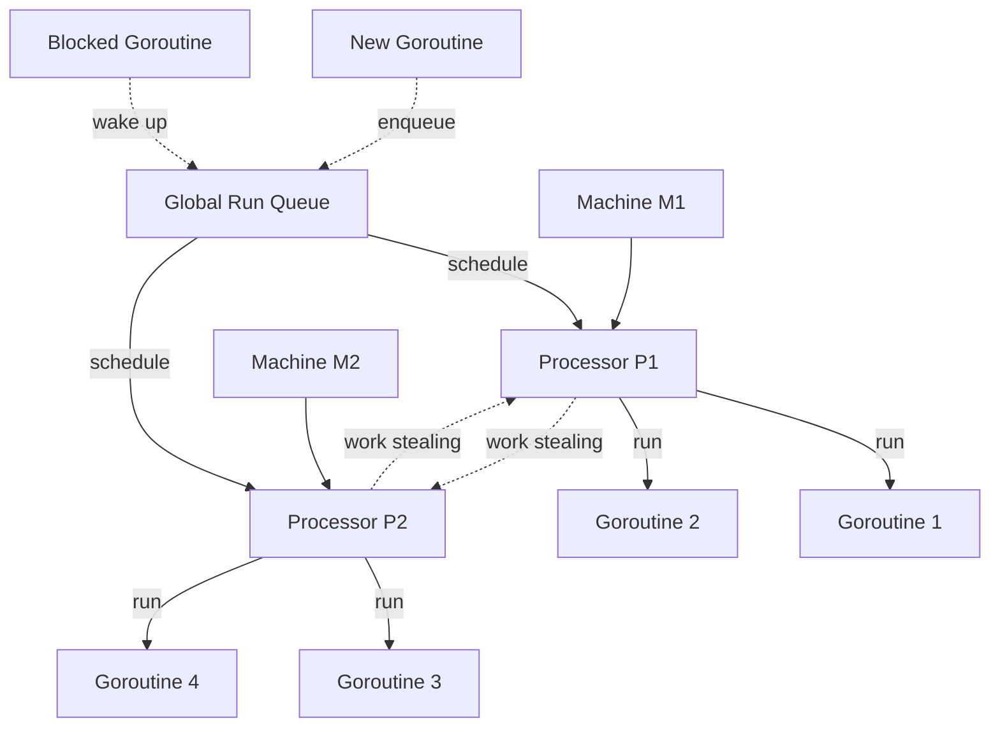
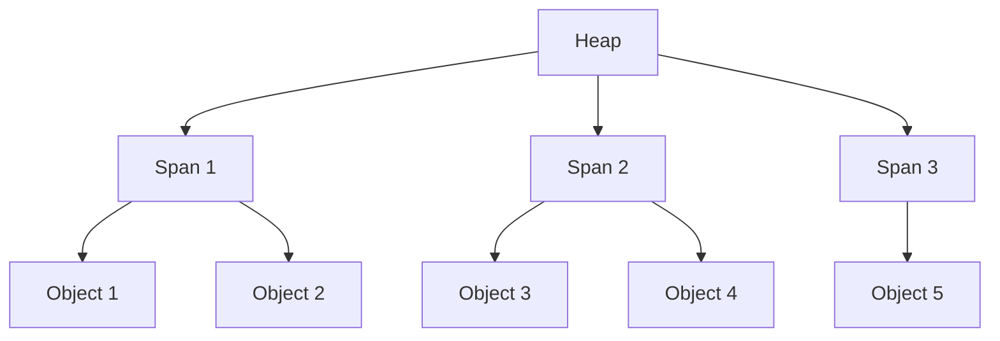
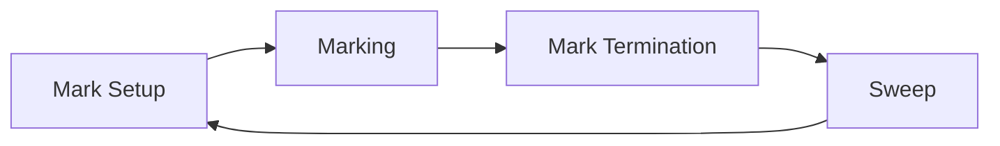

# Comprehensive and In-Depth Advanced Golang Concepts

## 1. GMP Model and Goroutine Scheduling

### 1.1 GMP Model in Detail

The GMP model is the cornerstone of Go's runtime scheduler. It consists of three primary components: G (Goroutine), M (Machine), and P (Processor).



#### G (Goroutine)
Goroutines are the fundamental unit of execution in Go. They are lightweight, user-space threads managed by the Go runtime.

Key characteristics:
- Represented by the `runtime.g` struct
- Initial stack size of 2KB, which can grow up to 1GB
- Extremely lightweight (creation of thousands of goroutines is common)

Important fields in the `runtime.g` struct:
- `stack`: Describes the stack memory
- `stackguard0`: Used for stack growth checks
- `m`: Current M running this goroutine
- `sched`: Scheduling info (e.g., PC, SP)
- `atomicstatus`: Goroutine status (running, runnable, waiting, etc.)
- `goid`: Unique goroutine identifier
- `waitsince`: Time when the goroutine began waiting (for deadlock detection)
- `waitreason`: Reason for waiting (e.g., chan receive, sleep)

Example of goroutine creation and management:

```go
package main

import (
    "fmt"
    "runtime"
    "sync"
)

func main() {
    var wg sync.WaitGroup
    for i := 0; i < 10000; i++ {
        wg.Add(1)
        go func(id int) {
            defer wg.Done()
            // Simulate some work
            runtime.Gosched() // Yield the processor
            fmt.Printf("Goroutine %d finished\n", id)
        }(i)
    }
    
    // Wait for all goroutines to finish
    wg.Wait()
    
    // Print stats
    fmt.Printf("Number of goroutines: %d\n", runtime.NumGoroutine())
}
```

#### M (Machine)
M represents an OS thread, also known as a machine thread. It's the entity that actually executes the code.

Key characteristics:
- Represented by the `runtime.m` struct
- Number of Ms can be limited by GOMAXPROCS
- Can be in various states: spinning, non-spinning, blocked in syscall

Important fields in the `runtime.m` struct:
- `g0`: Special goroutine for scheduling
- `curg`: Current user goroutine
- `p`: Associated P, or nil if not running
- `nextp`: Next P to run this M
- `spinning`: Whether this M is spinning
- `blocked`: Whether this M is blocked on a syscall
- `park`: Park/unpark state for syscalls

Example of controlling the number of OS threads:

```go
package main

import (
    "fmt"
    "runtime"
    "time"
)

func main() {
    // Get the current number of OS threads
    fmt.Printf("Initial number of OS threads: %d\n", runtime.GOMAXPROCS(-1))
    
    // Set the maximum number of OS threads to 2
    runtime.GOMAXPROCS(2)
    
    // Verify the change
    fmt.Printf("New number of OS threads: %d\n", runtime.GOMAXPROCS(-1))
    
    // Create more goroutines than available threads
    for i := 0; i < 100; i++ {
        go func(id int) {
            time.Sleep(time.Second)
            fmt.Printf("Goroutine %d finished\n", id)
        }(i)
    }
    
    // Wait for goroutines to finish
    time.Sleep(2 * time.Second)
}
```

#### P (Processor)
P is a logical processor that acts as a resource scheduler. It's an abstraction that couples an M to a context where Go can run goroutines.

Key characteristics:
- Represented by the `runtime.p` struct
- Number of Ps equals GOMAXPROCS (default is number of CPU cores)
- Manages a local run queue of goroutines

Important fields in the `runtime.p` struct:
- `status`: Idle, running, syscall, or gc
- `m`: Associated M
- `runq`: Local run queue
- `runnext`: Next G to run
- `mcache`: Memory allocator cache
- `schedtick`: Incremented on every scheduler call
- `syscalltick`: Incremented on every system call
- `sysmontick`: Last tick observed by sysmon

Example of inspecting runtime statistics:

```go
package main

import (
    "fmt"
    "runtime"
    "time"
)

func main() {
    // Create a ticker to periodically print stats
    ticker := time.NewTicker(time.Second)
    defer ticker.Stop()

    // Create some background work
    for i := 0; i < 100; i++ {
        go func() {
            for {
                time.Sleep(time.Millisecond)
            }
        }()
    }

    // Print stats every second
    for i := 0; i < 10; i++ {
        <-ticker.C
        printStats()
    }
}

func printStats() {
    var stats runtime.MemStats
    runtime.ReadMemStats(&stats)

    fmt.Printf("Goroutines: %d\n", runtime.NumGoroutine())
    fmt.Printf("OS Threads: %d\n", runtime.GOMAXPROCS(-1))
    fmt.Printf("Heap Alloc: %d MB\n", stats.HeapAlloc/1024/1024)
    fmt.Printf("Heap Objects: %d\n", stats.HeapObjects)
    fmt.Println("---")
}
```

### 1.2 Goroutine Scheduling in Depth

The Go scheduler is a complex system designed to efficiently manage goroutines across available resources. Let's delve into its inner workings.



#### 1.2.1 Scheduler Data Structures

1. **Global Run Queue (GRQ)**
   - Holds runnable goroutines not assigned to any P
   - Represented by `sched.runq` in the runtime
   - Used when local run queues are full or during work stealing
   - Implemented as a lock-free ring buffer

2. **Local Run Queue (LRQ)**
   - Each P has its own LRQ
   - Holds goroutines assigned to that P
   - Implemented as a circular queue with a fixed size of 256
   - When full, half of the goroutines are moved to the GRQ

3. **Idle M List**
   - Tracks idle OS threads
   - Managed by the scheduler
   - Used to quickly find an M when a goroutine becomes runnable

4. **Idle P List**
   - Maintains idle P structures
   - Used when allocating P to new M
   - Helps in quick P acquisition for waiting Ms

#### 1.2.2 Scheduling Algorithm

The Go scheduler follows a set of rules to determine which goroutine to run next:

1. When a new goroutine is created:
   - If there's space in the current P's local run queue, add it there
   - Otherwise, add it to the global run queue

2. When a P needs to find a goroutine to run:
   - Check its local run queue first
   - If empty, check the global run queue
   - If still empty, try to steal work from other Ps

3. When a goroutine blocks (e.g., on I/O or channel operations):
   - The current M will detach from its P
   - Another M will pick up the P and continue running goroutines

4. When a goroutine unblocks:
   - It's placed back on a run queue (local or global)
   - If there's an idle P, it may be scheduled immediately

Here's a simplified version of the scheduler's main loop:

```go
func schedule() {
    // This function never returns. It will run the scheduler in an infinite loop.
    for {
        // Find a runnable goroutine to execute
        gp := findRunnable()

        // Execute the goroutine
        execute(gp)

        // The goroutine has finished or yielded. Clean up and prepare for the next one.
        if gp.is_finished {
            gp.destroy()
        } else {
            // The goroutine yielded. Put it back in a run queue.
            runqput(gp)
        }
    }
}

func findRunnable() *g {
    // Check local run queue
    if gp := runqget(); gp != nil {
        return gp
    }

    // Check global run queue
    if gp := globrunqget(); gp != nil {
        return gp
    }

    // Try to steal from other P's
    if gp := stealWork(); gp != nil {
        return gp
    }

    // No work found, prepare to go idle
    return nil
}
```

### 1.3 Advanced Scheduling Concepts

#### 1.3.1 Preemption

Go uses a combination of cooperative and preemptive scheduling:

1. **Cooperative Scheduling**
   - Goroutines yield control at certain points (e.g., function calls, channel operations)
   - Implemented through checks in the compiler-generated code

2. **Preemptive Scheduling**
   - Introduced in Go 1.14 for long-running goroutines
   - Uses asynchronous preemption via signals (SIGURG on Unix systems)
   - Allows interruption of CPU-bound goroutines

Example of a CPU-bound goroutine that can be preempted:

```go
func cpuIntensiveTask() {
    for i := 0; i < 1e10; i++ {
        // This loop can now be preempted by the scheduler
        heavyComputation()
    }
}
```

#### 1.3.2 Work Stealing

Work stealing is a technique used by the Go scheduler to balance load across processors:

1. When a P's local run queue is empty, it attempts to steal work from other Ps
2. The stealing process is randomized to avoid contention
3. If stealing fails, the P checks the global run queue and network poller

Implementation details:
- Uses a random starting point to avoid always stealing from the same P
- Steals half of the victim's local run queue to minimize future stealing

```go
func stealWork() *g {
    // Try to steal from other P's local run queues
    for i := 0; i < len(allP); i++ {
        if gp := trySteal(allP[i]); gp != nil {
            return gp
        }
    }
    return nil
}

func trySteal(p *p) *g {
    if !runqempty(p) {
        return runqsteal(p, nil)
    }
    return nil
}
```

#### 1.3.3 Syscall Handling

When a goroutine makes a syscall, special handling is required to ensure efficient use of resources:

1. The M running the goroutine enters syscall mode
2. The P is detached from the M to allow other goroutines to run
3. If there are no idle Ms, a new M may be created to run the P
4. When the syscall completes, the goroutine is rescheduled

Example of syscall handling:

```go
func performSyscall() {
    // Entering syscall
    entersyscall()
    
    // Perform the actual syscall
    result := syscall.Read(fd, buffer)
    
    // Exiting syscall
    exitsyscall()
    
    // Use the result
    processData(result)
}
```

#### 1.3.4 Spinning Threads

The Go scheduler uses spinning threads to reduce latency:

1. Some Ms may spin instead of going to sleep immediately
2. Spinning Ms check for new work frequently
3. This helps in quickly responding to newly runnable goroutines
4. The number of spinning Ms is limited to avoid wasting CPU

Spinning states:
- Spinning looking for work
- Spinning waiting for GRQ lock

### 1.4 Runtime Hooks and Tracing

Go provides several hooks and tracing capabilities for advanced scheduling analysis:

1. **Runtime Tracing**
   - Enabled with `runtime/trace` package
   - Provides detailed information about goroutine scheduling, GC, and more

2. **Scheduler Tracing**
   - Enabled with `GODEBUG=schedtrace=X` environment variable
   - Prints scheduler state every X milliseconds

3. **Execution Tracing**
   - Uses `runtime.Trace()` and `runtime.StopTrace()` functions
   - Allows for custom tracing points in code

Example of using runtime tracing:

```go
package main

import (
    "os"
    "runtime/trace"
)

func main() {
    // Create a trace file
    f, err := os.Create("trace.out")
    if err != nil {
        panic(err)
    }
    defer f.Close()

    // Start tracing
    err = trace.Start(f)
    if err != nil {
        panic(err)
    }
    defer trace.Stop()

    // Your program logic here
    for i := 0; i < 10; i++ {
        go func() {
            // Some work
        }()
    }

    // Wait for goroutines to finish
    // ...
}
```

To analyze the trace:
```
go tool trace trace.out
```

Certainly. I'll continue with an in-depth explanation of Memory Management and Garbage Collection in Go, focusing on advanced concepts and implementation details.

## 2. Memory Management and Garbage Collection

### 2.1 Memory Allocation in Go

Go's memory allocator is a complex system designed for high performance and low latency. It uses a combination of techniques to efficiently manage memory.

#### 2.1.1 Memory Allocator Overview

The Go memory allocator uses a hierarchical structure:

1. **Heap**: The main memory area where dynamically allocated objects reside.
2. **Spans**: Large blocks of memory (usually 8KB) used to allocate objects.
3. **Objects**: Individual allocated pieces of memory.



#### 2.1.2 Size Classes

Go uses size classes to group objects of similar sizes. This reduces fragmentation and improves allocation speed.

- There are about 70 size classes, ranging from 8 bytes to 32KB.
- Each size class has its own free list of available objects.

Example of size classes:
```go
var class_to_size = [_NumSizeClasses]uint16{
    0,
    8,
    16,
    24,
    32,
    48,
    64,
    80,
    // ... more sizes ...
    32768,
}
```

#### 2.1.3 TCMalloc Inspiration

Go's allocator is inspired by TCMalloc (Thread-Caching Malloc), with some key differences:

1. **Per-P Caches**: Instead of per-thread caches, Go uses per-P (processor) caches.
2. **Goroutine Stacks**: Special handling for goroutine stacks, which can grow and shrink.
3. **GC Integration**: Tight integration with the garbage collector.

#### 2.1.4 Allocation Process

1. For small objects (≤32KB):
   a. Check the P's mcache for a free object in the appropriate size class.
   b. If mcache is empty, refill it from the central cache (mcentral).
   c. If mcentral is empty, allocate a new span from the heap.

2. For large objects (>32KB):
   - Allocate directly from the heap, rounded up to a multiple of the page size.

Example of a simple allocation:

```go
func allocate(size uintptr) unsafe.Pointer {
    if size <= maxSmallSize {
        // Small allocation
        sizeclass := size_to_class(size)
        mcache := acquirem().p.ptr().mcache
        span := mcache.alloc[sizeclass]
        v := span.freelist
        if v.ptr() == nil {
            v = mcache.refill(sizeclass)
        }
        span.freelist = v.ptr().next
        return unsafe.Pointer(v)
    } else {
        // Large allocation
        return largeAlloc(size)
    }
}
```

### 2.2 Garbage Collection

Go uses a concurrent, tri-color mark-and-sweep garbage collector with write barriers.

#### 2.2.1 Garbage Collection Phases

1. **Mark Setup**: Preparation for marking phase.
2. **Marking**: Identifying live objects.
3. **Mark Termination**: Completion of marking phase.
4. **Sweep**: Reclaiming memory from dead objects.



#### 2.2.2 Tri-Color Algorithm

Objects are divided into three sets:

- **White**: Potentially garbage objects.
- **Gray**: Objects to be scanned.
- **Black**: Live objects, all pointers scanned.

The algorithm ensures that no black object points to a white object when marking is complete.

```go
func mark() {
    // Start with all objects white
    for obj := range allObjects {
        setWhite(obj)
    }
    
    // Mark roots as gray
    for root := range rootSet {
        setGray(root)
    }
    
    // Process gray objects
    for gray queue is not empty {
        obj := dequeue()
        scan(obj)
        setBlack(obj)
    }
}

func scan(obj *Object) {
    for child := range obj.pointers {
        if isWhite(child) {
            setGray(child)
        }
    }
}
```

#### 2.2.3 Write Barriers

Write barriers ensure correctness of the tri-color invariant during concurrent marking.

Example of a write barrier:

```go
func writePointer(slot *unsafe.Pointer, ptr unsafe.Pointer) {
    shade(ptr)
    *slot = ptr
}

func shade(ptr unsafe.Pointer) {
    if ptr != nil && isWhite(ptr) {
        setGray(ptr)
    }
}
```

#### 2.2.4 GC Triggers

Go's GC can be triggered by various events:

1. Automatic: Based on heap growth (target is 100% heap growth).
2. Forced: By calling `runtime.GC()`.
3. Pacing: GC runs to meet target heap size and CPU utilization.

#### 2.2.5 GC Tuning

Go provides several environment variables and runtime functions for GC tuning:

- `GOGC`: Sets the initial garbage collection target percentage.
- `GOMEMLIMIT`: Sets a soft memory limit for the heap.

Example of setting GC percentage programmatically:

```go
import "runtime/debug"

func main() {
    // Set GC target to 50% (collect when heap doubles)
    debug.SetGCPercent(50)
    
    // Run your program...
}
```

#### 2.2.6 Sweeping

After marking, sweeping reclaims memory from dead objects:

1. Spans with no live objects are returned to the heap.
2. Spans with some live objects have their free lists rebuilt.
3. Sweeping is done concurrently and on-demand.

Example of a simplified sweep function:

```go
func sweep(span *mspan) {
    for obj := span.startAddr; obj < span.endAddr; obj += span.elemsize {
        if isMarked(obj) {
            unmark(obj)
        } else {
            // Object is dead, add to free list
            span.freeIndex++
            *(*unsafe.Pointer)(obj) = span.freelist
            span.freelist = obj
        }
    }
    if span.freeIndex == span.nelems {
        // All objects are free, return span to heap
        returnToHeap(span)
    }
}
```

### 2.3 Advanced Memory Management Concepts

#### 2.3.1 Stack Allocation

Go uses stack allocation for objects that don't escape to the heap:

1. Escape analysis determines if an object can be stack-allocated.
2. Stack objects have very low allocation/deallocation costs.
3. Stacks can grow and shrink as needed.

Example of stack vs heap allocation:

```go
func stackAlloc() int {
    x := 5 // x is allocated on the stack
    return x
}

func heapAlloc() *int {
    x := new(int) // x is allocated on the heap
    *x = 5
    return x
}
```

#### 2.3.2 Tiny Allocations

Go has a special optimization for tiny allocations (objects ≤16 bytes):

1. Multiple tiny objects can be packed into a single memory block.
2. This significantly reduces memory overhead for small objects.

#### 2.3.3 Large Object Allocation

Large objects (>32KB) are handled differently:

1. Allocated directly from the heap.
2. Use a separate free list for efficient reuse.
3. May trigger immediate garbage collection if the heap grows too much.

#### 2.3.4 Memory Profiling

Go provides built-in support for memory profiling:

1. Use `runtime/pprof` package or `go test -memprofile` flag.
2. Analyze with `go tool pprof` for detailed memory usage information.

Example of memory profiling:

```go
import (
    "os"
    "runtime/pprof"
)

func main() {
    f, _ := os.Create("mem.prof")
    defer f.Close()
    pprof.WriteHeapProfile(f)
    
    // Your program logic here
}
```

To analyze:
```
go tool pprof mem.prof
```

