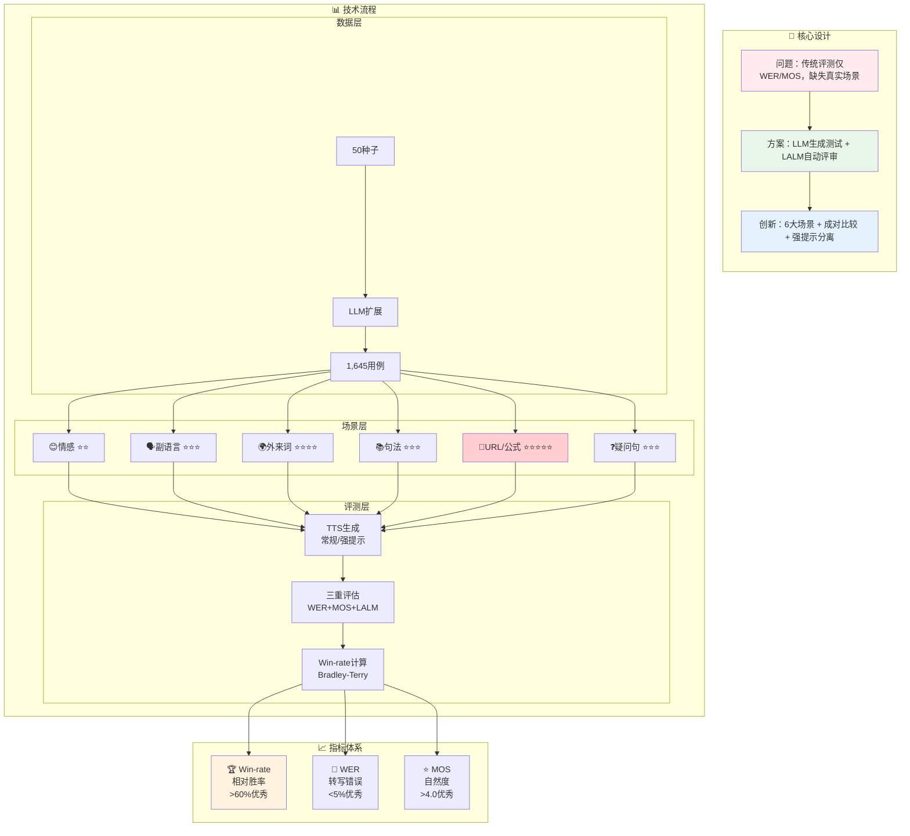

## TTS Eval - EmergentTTS-Eval 综合评测框架

> 🔗 **GitHub**: https://github.com/boson-ai/EmergentTTS-Eval-public  
> 📄 **论文**: arXiv:2505.23009 | **机构**: Boson AI | **发布**: 2025年5月

- **大型语言模型（LLM）** 迭代生成 **1,645 个多样化测试用例**，涵盖情感、副语言、外来词、句法复杂性、复杂发音和问题六个关键场景
- 采用 **模型即评判者（model-as-a-judge）** 方法，利用大型音频语言模型（LALM）评估语音的多个维度，如表达的情感、韵律、语调和发音准确性
- 文本标准化（Text Normalization）：基本的 TN 技术不总是能改善模型在基准测试中的性能，甚至可能使其变差。例如，WeText 将 `'$1,890.125375'` 转换为 `‘one thousand eight hundred and ninety point one dollars twenty five thousand three hundred and seventy five’`，这损害了 TTS 质量。使用 LLM（如 GPT-4.1-mini）作为 TN 能解决许多问题并显著提高胜率。
- 根据 EmergentTTS-Eval 的研究，“GPT-4o-mini-tts (Alloy voice) 开启强提示” 确实意味着：通过提供详细且有针对性的提示词，可以显著提升其在发音数学公式方面的准确性。

### Prompt

```
# Role
You are a mathematical notation converter that transforms mathematical symbols and formulas into natural readable text for text-to-speech systems. Your primary goal is to generate output that is clear, concise, and sounds natural when spoken aloud.

## Task
Convert all mathematical notations (including LaTeX formulas and numeric expressions) into language-appropriate spoken text that sounds natural and is easy to understand when read aloud by a TTS system.

## Rules

### Language Detection and Output
- First, analyze the Original text to determine its language (Chinese, English, or other languages).
- If the language cannot be clearly determined, use English as the default.
- Your ENTIRE response must be in the SAME language as determined above.
- Do not mix languages under any circumstances.
- You must strictly follow the grammatical and syntactical rules of the detected language.
```

### Script 1


```
所以\angle BOC = 360^{\circ}-90^{\circ}-90^{\circ}-\theta=180^{\circ}-\theta。
```

不使用强提示 vs 使用强提示


### Script 2


```
解题策略：
1. 矩阵加法(A+B)：对应位置元素相加
2. 矩阵减法(A-B)：对应位置元素相减

## **答案**:
1. $\boxed{\begin{pmatrix}7&7\\10&12\end{pmatrix}}$
2. $\boxed{\begin{pmatrix}-3&-5\\-4&-4\end{pmatrix}}$
3. $\boxed{\begin{pmatrix}17&20\\43&50\end{pmatrix}}$
4. $\boxed{\begin{pmatrix}4&2\\6&8\end{pmatrix}}$
```

不使用强提示 vs 使用强提示


### 🏗️ EmergentTTS-Eval 完整架构



### 🔗 更多资源

- 📄 [论文详情](https://arxiv.org/abs/2505.23009)
- 💾 [数据集](https://huggingface.co/datasets/bosonai/EmergentTTS-Eval)
- 🎵 [音频样本](https://drive.google.com/drive/folders/1SGEGaUai2UqOMbwXx447yZeY-6gCU0F_)


